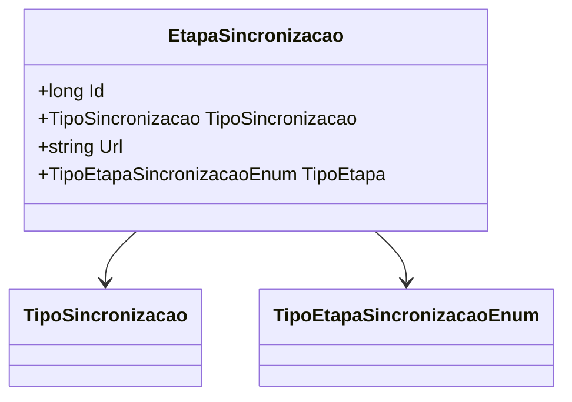

# EtapaSincronizacao
**Namespace**: IsthmusWinthor.Dominio.Entidades  
**Nome do Arquivo**: EtapaSincronizacao.cs

## Visão Geral e Responsabilidade
A classe `EtapaSincronizacao` representa uma etapa no processo de sincronização de dados. Seu objetivo é encapsular informações fundamentais sobre a sincronização, como o tipo de sincronização, a URL associada e o tipo da etapa. Esta estrutura permite um gerenciamento eficiente do fluxo de sincronização em um sistema corporativo, garantindo que as etapas corretas sejam seguidas e respeitando as definições de cada tipo de sincronização.

## Métodos de Negócio
*Não foram identificados métodos de negócio nesta classe; apenas propriedades são apresentadas.*

## Propriedades Calculadas e de Validação
*Não foram identificadas propriedades com lógica de cálculo no `get` ou validações especiais no `set` nesta classe.*

## Navigation Property
- `TipoSincronizacao`: [TipoSincronizacao](TipoSincronizacao.md)
- `TipoEtapa`: [TipoEtapaSincronizacaoEnum](TipoEtapaSincronizacaoEnum.md)

## Tipos Auxiliares e Dependências
- Enumeradores:
  - [TipoSincronizacao](TipoSincronizacao.md)
  - [TipoEtapaSincronizacaoEnum](TipoEtapaSincronizacaoEnum.md)

## Diagrama de Relacionamentos

---
Gerada em 29/12/2025 20:30:01
