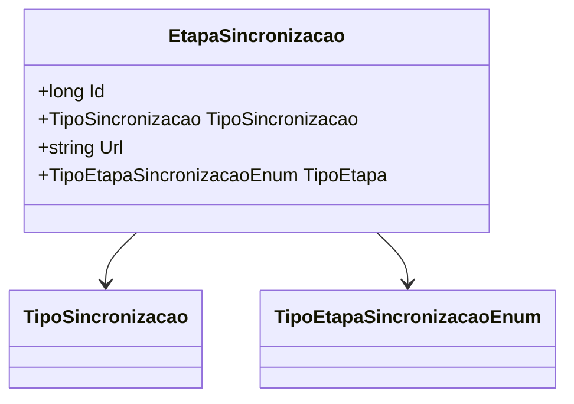

# EtapaSincronizacao
- **Namespace**: IsthmusWinthor.Dominio.Entidades
- **Nome do Arquivo**: EtapaSincronizacao.cs

## Visão Geral e Responsabilidade
A classe `EtapaSincronizacao` representa uma fase específica no processo de sincronização de dados. Ela é responsável por definir os parâmetros e o tipo de sincronização a ser realizado, permitindo um gerenciamento eficaz das etapas de integração entre sistemas. O problema de negócio que ela resolve é a necessidade de gerenciar e controlar os diferentes tipos de sincronizações e suas respectivas etapas, garantindo que o fluxo de dados entre os sistemas seja realizado de forma correta e eficiente.

## Métodos de Negócio
Nenhum método com lógica de negócio foi encontrado nesta classe. A classe atua como um modelo de domínio simples que contém dados.

## Propriedades Calculadas e de Validação
Nenhuma propriedade calculada ou de validação foi identificada.

## Navigation Properties
Nenhuma propriedade de navegação foi encontrada nesta classe.

## Tipos Auxiliares e Dependências
- `[TipoSincronizacao](TipoSincronizacao.md)`
- `[TipoEtapaSincronizacaoEnum](TipoEtapaSincronizacaoEnum.md)`

## Diagrama de Relacionamentos

