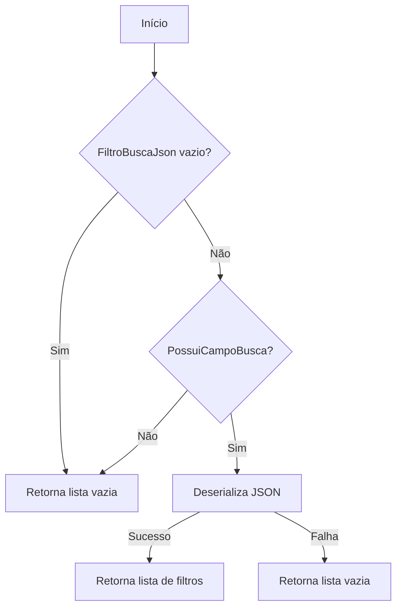
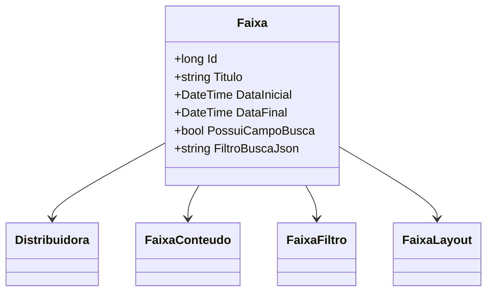

# Faixa
- **Namespace**: IsthmusWinthor.Dominio.Entidades
- **Nome do Arquivo**: Faixa.cs

## Visão Geral e Responsabilidade
A classe `Faixa` representa uma faixa de conteúdo associada a uma distribuidora no sistema. Sua principal responsabilidade é gerenciar informações sobre conteúdos exibidos, filtros de busca, tipos de soluções e layouts associados. Ela aborda a necessidade de apresentar informações de forma organizada e condicionalmente baseada em atributos como `DataInicial`, `DataFinal`, e `TipoFaixa`, garantindo que o conteúdo exibido ao usuário final seja sempre relevante e oportuno.

## Métodos de Negócio

### Método: `ToFiltro()` - Visibilidade: `private`
- **Objetivo**: Garante a conversão de um JSON armazenado na propriedade `FiltroBuscaJson` em uma lista de objetos `FiltroBusca`. Essa conversão só deve ocorrer se o campo de busca estiver habilitado (`PossuiCampoBusca`).
- **Comportamento**:
  1. Verifica se `FiltroBuscaJson` está vazio ou se `PossuiCampoBusca` é falso. Se sim, retorna uma lista vazia.
  2. Utiliza `JsonConvert.DeserializeObject` para tentar transformar o JSON em uma lista de `FiltroBusca`.
  3. Caso a deserialização falhe (exceção capturada), retorna uma lista vazia.
- **Retorno**: Uma lista de objetos `FiltroBusca` a partir do JSON, ou uma lista vazia se o JSON estiver inválido ou se não houver campo de busca.

### Método: `FromFiltro(List<FiltroBusca> filtros)` - Visibilidade: `private`
- **Objetivo**: Garante a conversão de uma lista de `FiltroBusca` em um formato JSON, a ser armazenado na propriedade `FiltroBuscaJson`, novamente condicionado à habilitação do campo de busca.
- **Comportamento**:
  1. Verifica se a lista de filtros é nula, vazia ou se `PossuiCampoBusca` é falso. Se sim, retorna uma string vazia.
  2. Serializa a lista de filtros em formato JSON utilizando `JsonConvert.SerializeObject`.
  3. Se a serialização falhar (exceção capturada), retorna uma string vazia.
- **Retorno**: Uma string representando a lista de filtros em formato JSON, ou uma string vazia se não for possível representar os filtros.

### Visualização

## Propriedades Calculadas e de Validação
### Propriedades
- `FiltrosBusca`: Esta propriedade calcula uma lista de `FiltroBusca` a partir do JSON `FiltroBuscaJson`. Se não houver filtros válidos, retorna uma lista vazia, garantindo assim que a lógica do sistema mantenha sempre dados válidos e corretos.
- `ListaTiposSolucoes`: Calcula uma lista de `TipoSolucao` baseada na string armazenada na propriedade `TiposSolucoes`. Se a string estiver vazia, retorna uma lista com um valor padrão.

## Navigations Property
- `[Distribuidora](Distribuidora.md)`
- `[FaixaConteudo](FaixaConteudo.md)`
- `[FaixaFiltro](FaixaFiltro.md)`
- `[FaixaLayout](FaixaLayout.md)`

## Tipos Auxiliares e Dependências
- `[TipoSolucao](TipoSolucao.md)`
- `[LocalExibicao](LocalExibicao.md)`
- `[TipoFaixa](TipoFaixa.md)`
- `[TipoConteudo](TipoConteudo.md)`
- `[FiltroBusca](FiltroBusca.md)`

## Diagrama de Relacionamentos

