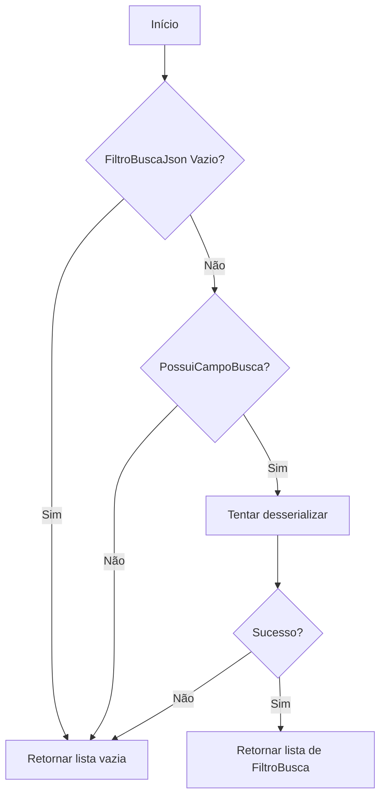
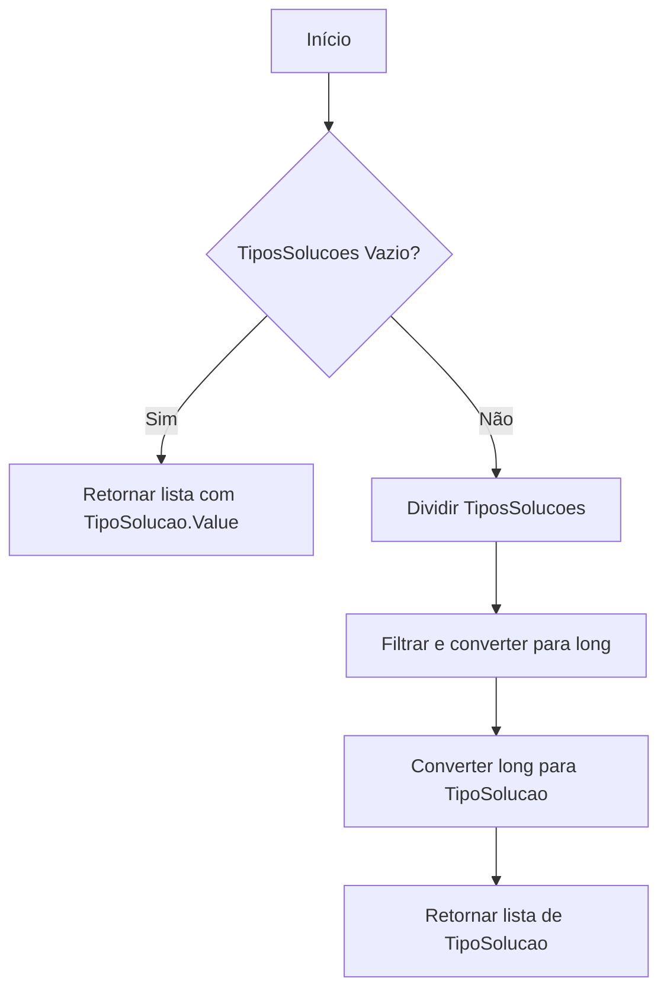
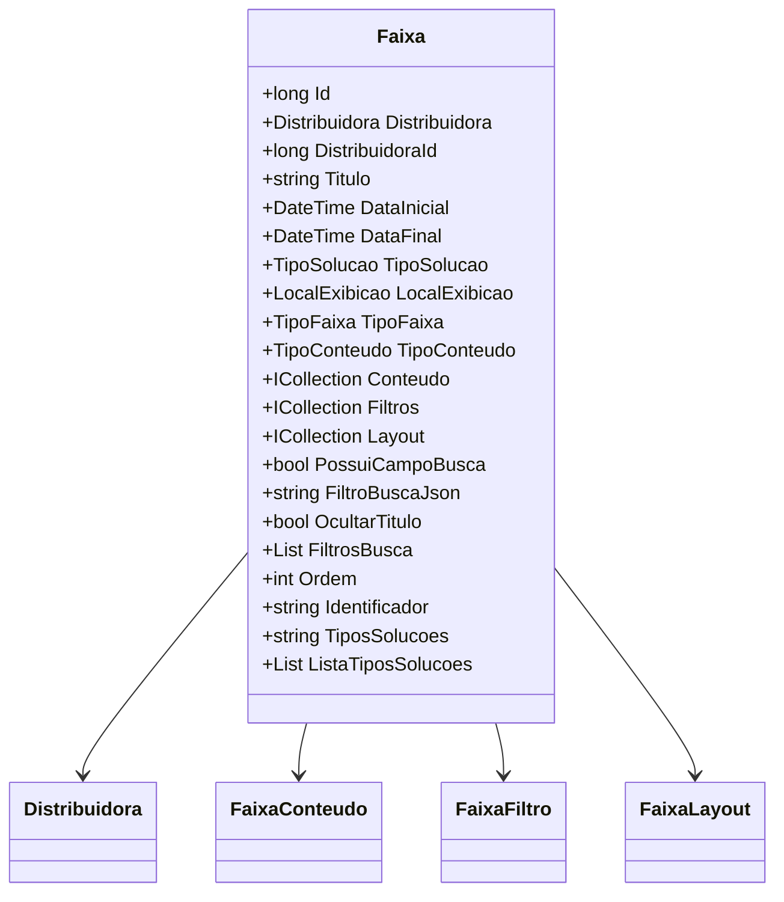

# Faixa
**Namespace**: IsthmusWinthor.Dominio.Entidades  
**Nome do Arquivo**: Faixa.cs  

## Visão Geral e Responsabilidade
A classe `Faixa` representa um conceito central no sistema, atuando na gestão de faixas exibidas pela distribuidora. Sua responsabilidade é definir as propriedades e comportamentos de uma faixa, controlando a exibição de conteúdos em um determinado intervalo de datas, e possibilitando a configuração de filtros e layouts associados. Isso resolve o problema de negócios de oferecer uma visualização personalizada e dinâmica de conteúdos, otimizando a interação do usuário com as ofertas disponíveis.

## Métodos de Negócio

### Título: `ToFiltro` - Visibilidade: `private`
- **Objetivo:** Converte a string JSON armazenada em `FiltroBuscaJson` em uma lista de objetos do tipo `FiltroBusca`, garantindo que os filtros sejam apropriados e úteis.
- **Comportamento:** 
  1. Verifica se `FiltroBuscaJson` está vazio ou se `PossuiCampoBusca` é `false`. Se sim, retorna uma lista vazia.
  2. Tenta desserializar `FiltroBuscaJson` para uma lista de `FiltroBusca`.
  3. Se a desserialização falhar (exceção), retorna uma lista vazia.
- **Retorno:** Retorna uma lista de `FiltroBusca`.

### Título: `ListaTiposSolucoes` - Visibilidade: `public`
- **Objetivo:** Retornar uma lista de tipos de soluções a partir da string `TiposSolucoes`, fornecendo flexibilidade na configuração de múltiplas soluções.
- **Comportamento:** 
  1. Verifica se `TiposSolucoes` está vazia. Se sim, retorna uma lista com um valor padrão.
  2. Divide a string em partes, filtrando valores vazios e convertendo em `long`.
  3. Converte cada `long` para `TipoSolucao` e retorna a lista resultante.
  4. Em caso de exceções, retorna uma lista vazia.
- **Retorno:** Retorna uma lista de `TipoSolucao`.

## Propriedades Calculadas e de Validação
### Propriedades:
- **FiltrosBusca:** 
  - É a representação em forma de lista de `FiltroBusca` que é derivada de `FiltroBuscaJson`. Se os dados de entrada não forem válidos, uma lista vazia é retornada.
  
- **ListaTiposSolucoes:**
  - Representa os tipos de soluções extraídos da string `TiposSolucoes`. A ausência de dados resulta em um valor padrão.

## Navigation Property
- **Distribuidora:** Representa uma relação de associação com a classe [Distribuidora](Distribuidora.md).
- **Conteudo:** Coleção de itens do tipo [FaixaConteudo](FaixaConteudo.md).
- **Filtros:** Coleção de itens do tipo [FaixaFiltro](FaixaFiltro.md).
- **Layout:** Coleção de itens do tipo [FaixaLayout](FaixaLayout.md).

## Tipos Auxiliares e Dependências
- **Enumeradores:**
  - [TipoSolucao](TipoSolucao.md)
  - [LocalExibicao](LocalExibicao.md)
  - [TipoFaixa](TipoFaixa.md)
  - [TipoConteudo](TipoConteudo.md)
  
- **Classes Estáticas/Helpers:**
  - JsonConvert (do pacote Newtonsoft.Json)

## Diagrama de Relacionamentos

---
Gerada em 29/12/2025 20:30:29
