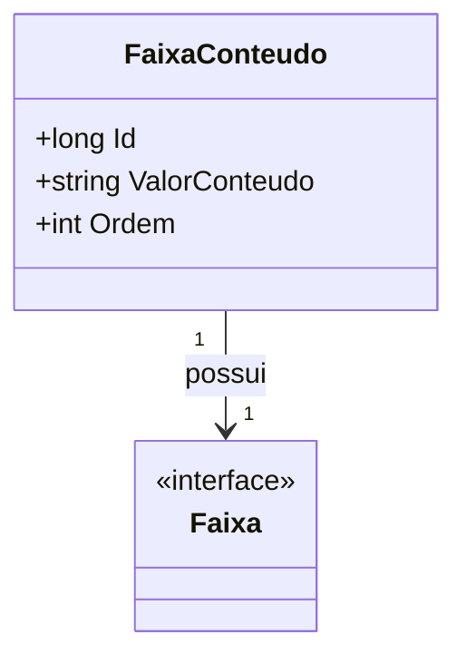

# FaixaConteudo
- **Namespace**: IsthmusWinthor.Dominio.Entidades
- **Nome do Arquivo**: FaixaConteudo.cs

## Visão Geral e Responsabilidade
A classe `FaixaConteudo` representa um conceito de faixa de conteúdo dentro do domínio do sistema. Seu papel é armazenar as informações associadas ao conteúdo que pertence a uma faixa, incluindo um valor de conteúdo e a ordem em que esse conteúdo deve ser exibido. Essa classe soluciona o problema de organização e apresentação de diferentes conteúdos relacionados a uma faixa específica, garantindo que o sistema possa manter uma estrutura coerente e ordenada de apresentação.

## Métodos de Negócio
(Observação: A classe não possui métodos com lógica significativa além dos simples getters e setters.)

## Propriedades Calculadas e de Validação
(Observação: Não existem propriedades com lógica de cálculo ou validação.)

## Navigation Properties
- [Faixa](Faixa.md)

## Tipos Auxiliares e Dependências
(Observação: Esta classe não depende de tipos auxiliares, Enums ou classes estáticas.)

## Diagrama de Relacionamentos

