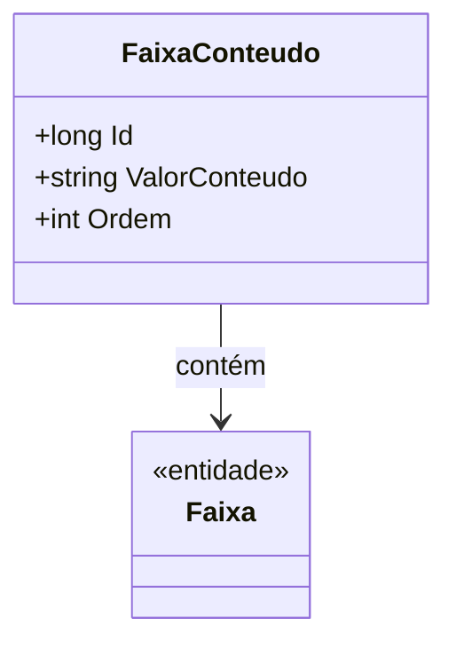

# FaixaConteudo
- **Namespace**: IsthmusWinthor.Dominio.Entidades
- **Nome do Arquivo**: FaixaConteudo.cs

## Visão Geral e Responsabilidade
A classe `FaixaConteudo` representa um elemento dentro de uma faixa que contém informações de conteúdo, como um valor específico e uma ordem de prioridade. O objetivo de negócios é gerenciar a relação entre uma faixa e seu conteúdo associado, garantindo que o conteúdo esteja sempre acessível e organizado de acordo com a sua ordem.

## Métodos de Negócio
### Título: N/A
- **Objetivo**: Esta classe não possui métodos de negócio com lógica, portanto, não se aplica neste contexto.

## Propriedades Calculadas e de Validação
- As propriedades da classe não contêm lógica complexa em seus `getters` ou `setters`.

## Navigations Property
- [Faixa](Faixa.md)

## Tipos Auxiliares e Dependências
- Esta classe não depende de enumeradores ou classes estáticas/Helpers.

## Diagrama de Relacionamentos

---
Gerada em 29/12/2025 20:30:36
