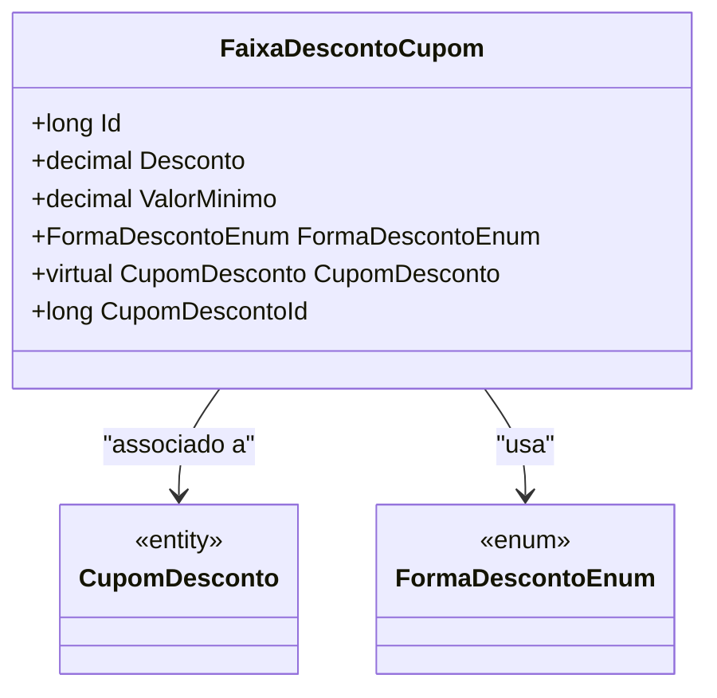

# FaixaDescontoCupom
- **Namespace**: IsthmusWinthor.Dominio.Entidades
- **Nome do Arquivo**: FaixaDescontoCupom.cs

## Visão Geral e Responsabilidade
A classe `FaixaDescontoCupom` representa uma faixa de desconto associada a um cupom de desconto. Ela é responsável por armazenar as condições sob as quais um desconto específico pode ser aplicado, como o valor mínimo de compra necessário e a forma como o desconto é calculado. Este modelo visa garantir que os descontos sejam aplicados de maneira consistente e conforme as regras estabelecidas, contribuindo para uma estratégia de marketing mais eficaz e para a fidelização de clientes.

## Métodos de Negócio
Esta classe não possui métodos de negócio com lógica complexa. Todos os métodos são simples getters e setters.

## Propriedades Calculadas e de Validação
Esta classe não possui propriedades que implementem lógica no `get` ou validação no `set`. As propriedades são diretamente acessíveis e não possuem validações adicionais.

## Navigations Property
- `CupomDesconto`: Classe complexa que representa o cupom de desconto associado.  
  Link: `[CupomDesconto](CupomDesconto.md)`

## Tipos Auxiliares e Dependências
- Enumerador: `[FormaDescontoEnum](FormaDescontoEnum.md)`

## Diagrama de Relacionamentos

