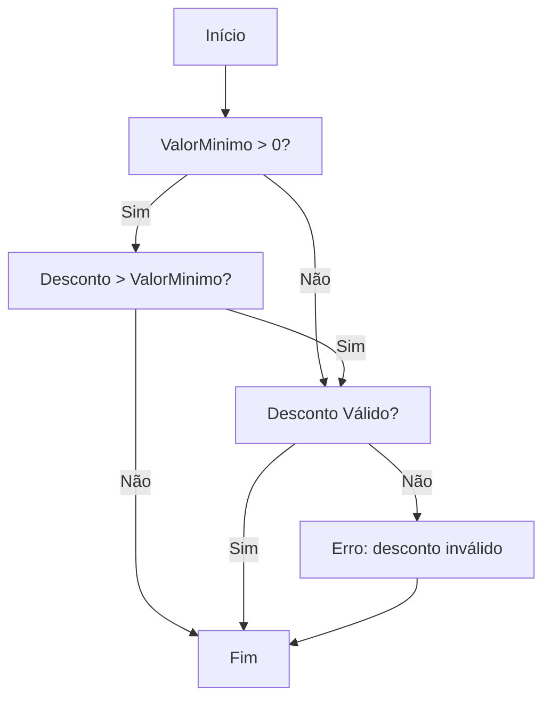
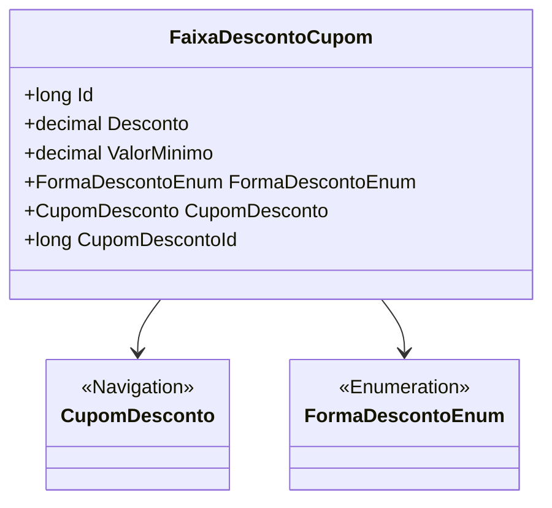

# FaixaDescontoCupom
**Namespace**: IsthmusWinthor.Dominio.Entidades  
**Nome do Arquivo**: FaixaDescontoCupom.cs  

## Visão Geral e Responsabilidade
A classe **FaixaDescontoCupom** representa uma faixa de desconto associada a um cupom de desconto em um sistema de e-commerce. Seu papel principal é encapsular as regras de negócio que determinam como o desconto é aplicado com base em um valor mínimo de compra. Essa classe é fundamental para garantir que os descontos sejam aplicados corretamente, conforme as políticas e promoções definidas.

## Métodos de Negócio
### Título: ValidarDesconto (public)
#### Objetivo:
Garante que o desconto aplicado atenda aos critérios de valor mínimo e forma de desconto definidos.

#### Comportamento:
1. Verifica se o `ValorMinimo` é maior que zero.
2. Se o `Desconto` for maior que o `ValorMinimo`, retorna um erro indicando que o desconto não pode ser maior que o valor mínimo.
3. Retorna um resultado que confirma se o desconto é válido.

#### Retorno:
Um valor booleano indicando se o desconto é válido ou não.

### Visualização

## Propriedades Calculadas e de Validação
- **Desconto**: Esta propriedade deve ser validada para garantir que não exceda o valor mínimo definido por `ValorMinimo`. Se `Desconto` for maior que `ValorMinimo`, a aplicação do desconto não será permitida.

## Navigations Property
- [CupomDesconto](CupomDesconto.md): Esta propriedade representa a relação com a classe que gerencia os cupons de desconto, estabelecendo uma associação direta com o objeto `CupomDesconto` correspondente.

## Tipos Auxiliares e Dependências
- [FormaDescontoEnum](FormaDescontoEnum.md): Enumerador que define as diferentes formas que um desconto pode assumir (percentual, fixo, etc.).

## Diagrama de Relacionamentos

---
Gerada em 29/12/2025 20:30:52
