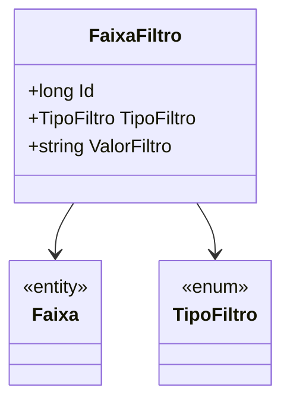

# FaixaFiltro
- **Namespace**: IsthmusWinthor.Dominio.Entidades
- **Nome do Arquivo**: FaixaFiltro.cs

## Visão Geral e Responsabilidade
A classe `FaixaFiltro` atua como um modelo rico dentro do domínio, representando uma faixa de valores que determina um critério de filtro na aplicação. Ela é usada para especificar condições de filtragem com base em um tipo e um valor, permitindo à lógica de negócio aplicar filtros de forma flexível, garantindo que apenas os dados desejados sejam apresentados ou processados.

## Métodos de Negócio
Atualmente, a classe `FaixaFiltro` não possui métodos complexos com lógica de negócio que precisam ser descritos, uma vez que é mais focada em armazenar dados e não contém comportamento significativo.

## Propriedades Calculadas e de Validação
- **Propriedade `ValorFiltro`:** 
  - A classe não possui lógica de validação visível nem propriedades com lógica complexa no `get`, portanto não foram identificadas propriedades calculadas ou de validação.

## Navigations Property
- **Propriedades de Navegação:**
  - `Faixa`: representa uma referência a uma faixa [Faixa](Faixa.md).

## Tipos Auxiliares e Dependências
- **Enumeradores:**
  - `TipoFiltro`: um enumerador [TipoFiltro](TipoFiltro.md) que define os tipos de filtros possíveis que podem ser aplicados à faixa.

## Diagrama de Relacionamentos

