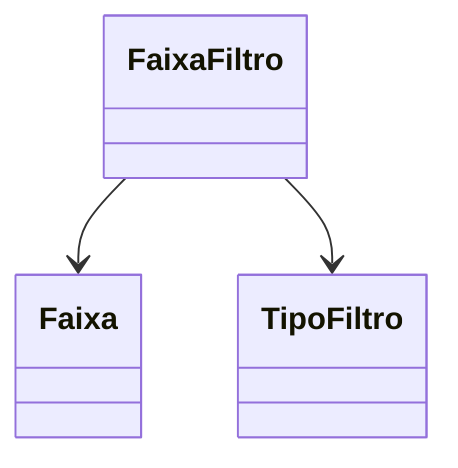

# FaixaFiltro
**Namespace**: IsthmusWinthor.Dominio.Entidades  
**Nome do Arquivo**: FaixaFiltro.cs  

## Visão Geral e Responsabilidade
A classe `FaixaFiltro` representa um filtro aplicado a uma faixa de dados em um contexto de domínio. O seu objetivo é encapsular as regras que determinam como os dados devem ser filtrados com base em um tipo específico de filtro e um valor associado. Isso permite que a aplicação execute pesquisas e recuperações de informações de maneira eficaz, assegurando que as operações atendam a critérios empresariais predefinidos.

## Métodos de Negócio
- **Título**: N/A (não existem métodos com lógica de negócio na classe)

## Propriedades Calculadas e de Validação
- **ValorFiltro**: É necessário garantir que o valor configurado atenda a requisitos de validação específica, que não estão presentes na implementação fornecida.

## Navigation Property
- **Faixa**: [Faixa](Faixa.md)

## Tipos Auxiliares e Dependências
- **TipoFiltro**: [TipoFiltro](TipoFiltro.md)

## Diagrama de Relacionamentos

---
Gerada em 29/12/2025 20:30:59
