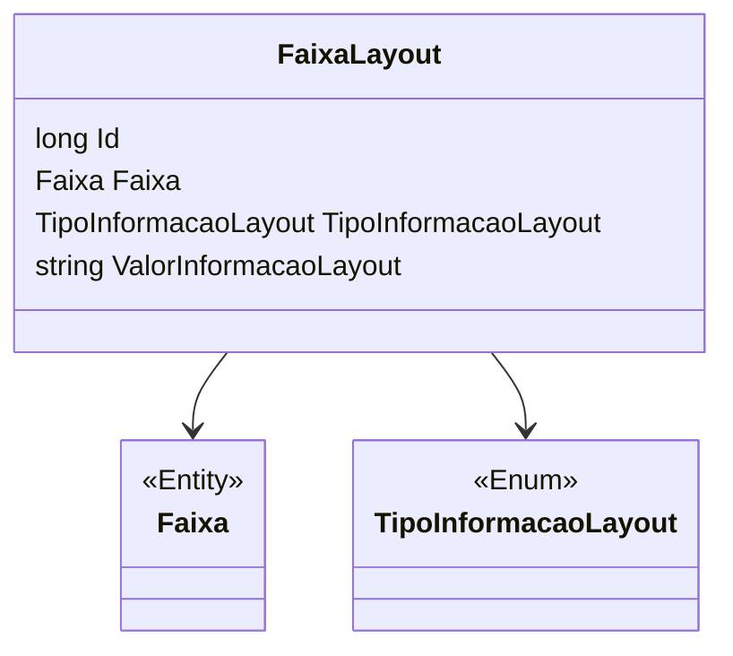

# FaixaLayout
**Namespace**: IsthmusWinthor.Dominio.Entidades  
**Nome do Arquivo**: FaixaLayout.cs  

## Visão Geral e Responsabilidade
A classe `FaixaLayout` representa uma estrutura que armazena informações de layout em uma faixa específica. Sua responsabilidade principal é encapsular a lógica necessária para configurar e gerenciar dados relacionados a diferentes tipos de informações de layout em um contexto que envolve faixas e tipos de informação. Isso contribui para a integridade dos dados ao garantir que as informações de layout estejam devidamente associadas a faixas específicas e categorizadas por tipo, visando facilitar a manipulação e visualização dessas relações.

## Métodos de Negócio
(Note que como o código fornecido não possui métodos com lógica de negócio além dos getters/setters simples, esta seção está vazia.)

## Propriedades Calculadas e de Validação
- `ValorInformacaoLayout`: Assumindo que a definição do layout implique regras específicas sobre o valor que pode ser atribuído, seria importante validar se o valor da informação de layout obedece a um formato ou tipo esperado, embora essa lógica não esteja explicitamente presente no código.

## Navigations Property
- [Faixa](Faixa.md): Representa a faixa associada a este layout.

## Tipos Auxiliares e Dependências
- [TipoInformacaoLayout](TipoInformacaoLayout.md): Enumerador que define os tipos de informação que podem ser associados a um layout.

## Diagrama de Relacionamentos

---
Gerada em 29/12/2025 20:31:08
