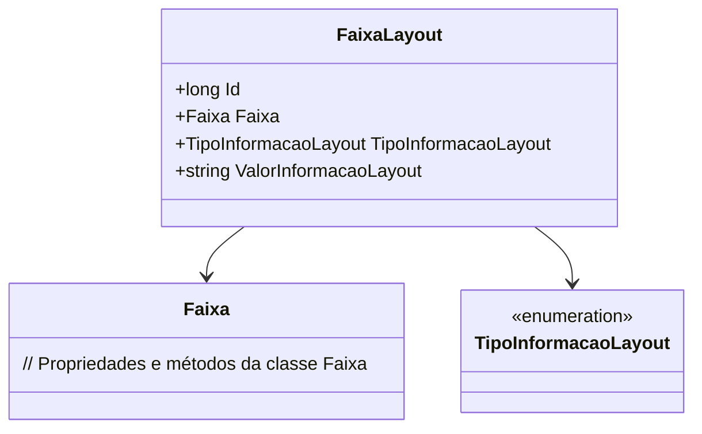

# FaixaLayout
**Namespace**: IsthmusWinthor.Dominio.Entidades  
**Nome do Arquivo**: FaixaLayout.cs  

## Visão Geral e Responsabilidade
A classe `FaixaLayout` representa uma faixa de layout utilizada na definição de informações estruturadas em sistemas. Ela tem um papel fundamental ao conectar uma faixa específica com um tipo de informação e seu respectivo valor, permitindo assim a organização correta e o tratamento dessas informações no sistema. Essa estrutura é essencial para garantir que dados associados a tipos de informações sejam manipulados de forma consistente e que a integridade dos dados seja mantida.

## Métodos de Negócio
(Nota: A classe não possui métodos com lógica complexa além dos simples getters/setters. Portanto, não há métodos de negócio a serem documentados.)

## Propriedades Calculadas e de Validação
- A classe `FaixaLayout` não contém propriedades calculadas ou validações específicas como parte de suas operações.

## Navigations Property
- [`Faixa`](Faixa.md): Referência a uma faixa específica do layout, representando a associação entre o layout e suas faixas.

## Tipos Auxiliares e Dependências
- [`TipoInformacaoLayout`](TipoInformacaoLayout.md): Enum que representa os tipos de informações que podem ser utilizadas no layout.

## Diagrama de Relacionamentos

