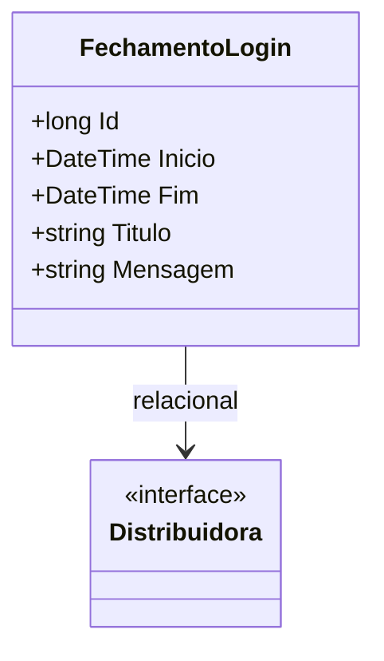

# FechamentoLogin
- **Namespace**: IsthmusWinthor.Dominio.Entidades
- **Nome do Arquivo**: FechamentoLogin.cs

## Visão Geral e Responsabilidade
A classe `FechamentoLogin` representa um modelo de domínio que encapsula a lógica relacionada ao fechamento de uma sessão de login em uma distribuidora. Sua principal responsabilidade é efetuar o controle e registro dos períodos em que a distribuidora está logada no sistema, permitindo assim uma melhor gestão do tempo de operação e análise de dados referentes aos acessos.

## Métodos de Negócio
Atualmente, a classe `FechamentoLogin` não possui métodos com lógica de negócios incluída, além de getters e setters simples.

## Propriedades Calculadas e de Validação
A classe não contém propriedades com lógica complexa no `get` ou validações significativas no `set`, dado que todas as propriedades são anêmicas e, portanto, carecem de regras específicas de negócio neste nível.

## Navigations Property
- `Distribuidora`: [Distribuidora](Distribuidora.md)

## Tipos Auxiliares e Dependências
- Nenhum enumerador ou classe auxiliar específica é utilizada nesta classe.

## Diagrama de Relacionamentos

---
Gerada em 29/12/2025 20:31:16
