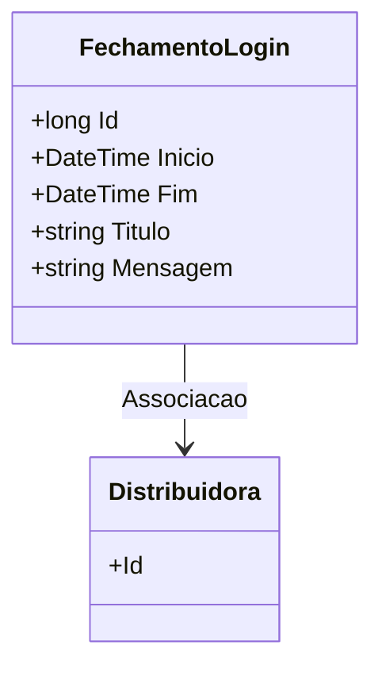

# FechamentoLogin
**Namespace**: IsthmusWinthor.Dominio.Entidades  
**Nome do Arquivo**: FechamentoLogin.cs  

## Visão Geral e Responsabilidade
A classe `FechamentoLogin` atua como um modelo de domínio que representa o fechamento de sessão de um login para um sistema, associado a uma `Distribuidora`. A responsabilidade principal desta classe é registrar o início e o fim das sessões de login, além de fornecer informações como título e mensagem associadas ao fechamento. Ela endereça a necessidade de rastrear e gerenciar sessões de login de forma estruturada, essencial para auditoria e controle de acesso.

## Métodos de Negócio
*Este modelo não possui métodos que apresentem lógica complexa ou relevantes, portanto, não foram detalhados neste documento.*

## Propriedades Calculadas e de Validação
- Não há propriedades na classe que apresentem lógica no `get` ou validação no `set`.

## Navigations Property
- [Distribuidora](Distribuidora.md)

## Tipos Auxiliares e Dependências
- Não utiliza tipos auxiliares ou enumeradores, exceto o tipo nativo `DateTime`.

## Diagrama de Relacionamentos

