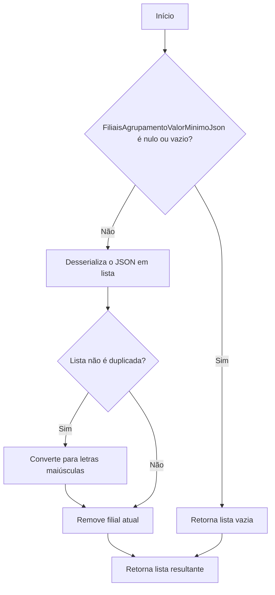
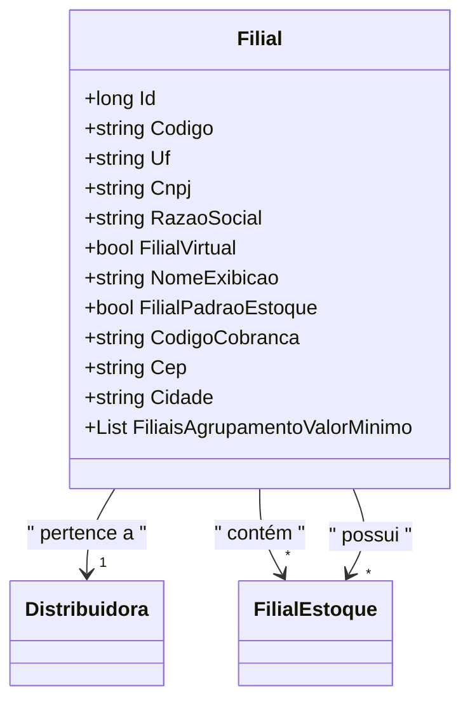

# Filial
**Namespace**: IsthmusWinthor.Dominio.Entidades  
**Nome do Arquivo**: Filial.cs  

## Visão Geral e Responsabilidade
A classe `Filial` representa uma filial de uma distribuidora dentro do sistema. Ela é responsável por armazenar informações relevantes sobre cada unidade, como códigos, localização e atributos específicos que definem como essa filial opera dentro do contexto do sistema. A lógica de agrupamento de filiais e validação da propriedade baseada em JSON assegura que os dados relacionados às filiais sejam tratados de forma consistente e segura, aumentando a integridade dos dados e facilitando futuras operações de agrupamento e consulta.

## Métodos de Negócio

### Título: `FiliaisAgrupamentoValorMinimo` (get/set)
**Objetivo**: Este método gerencia a maneira como as filiais agrupadas são armazenadas e acessadas no sistema, assegurando que não haja duplicatas e que o código da filial atual não seja incluído na lista.

**Comportamento**:
1. Ao acessar a propriedade através do `get`, a classe tenta desserializar um JSON que contém a lista das filiais agrupadas.
2. Se a desserialização for bem-sucedida, aplica as seguintes regras:
   - Converte todos os códigos para letras maiúsculas.
   - Remove duplicatas usando Distinct.
   - Filtra para que o código da filial atual não esteja presente na lista.
3. Se a desserialização falhar, retorna uma lista vazia.
4. Ao definir a propriedade através do `set`, o método assegura que a lista não seja nula ou vazia. O valor é então serializado e armazenado em formato JSON.

**Retorno**: O método retorna uma lista de strings que representa os códigos das filiais agrupadas, excluindo o código da filial atual.

## Propriedades Calculadas e de Validação
### `FiliaisAgrupamentoValorMinimo`
Esta propriedade possui uma lógica de validação que assegura a integridade dos dados ao assegurar que:
- Não haja entradas duplicadas na lista de filiais agrupadas.
- O código da filial atual não é incluído.

## Navigations Property
- [`Distribuidora`](Distribuidora.md)
- [`FilialEstoque`](FilialEstoque.md)

## Tipos Auxiliares e Dependências
- [JsonConvert](https://www.newtonsoft.com/json) (Biblioteca para manipulação de JSON)

## Diagrama de Relacionamentos

