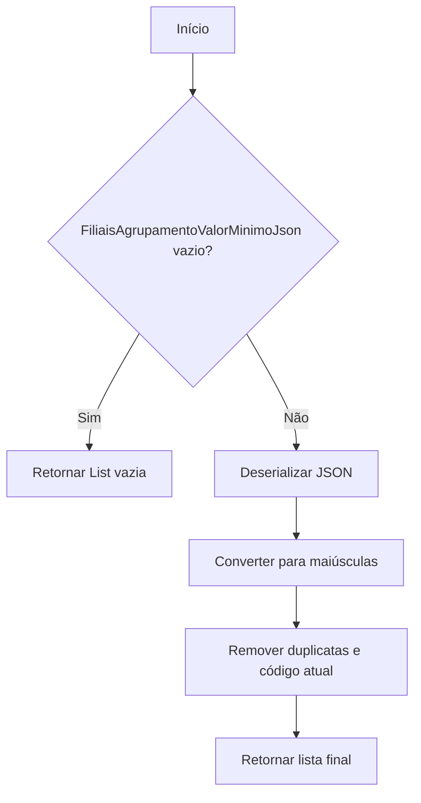
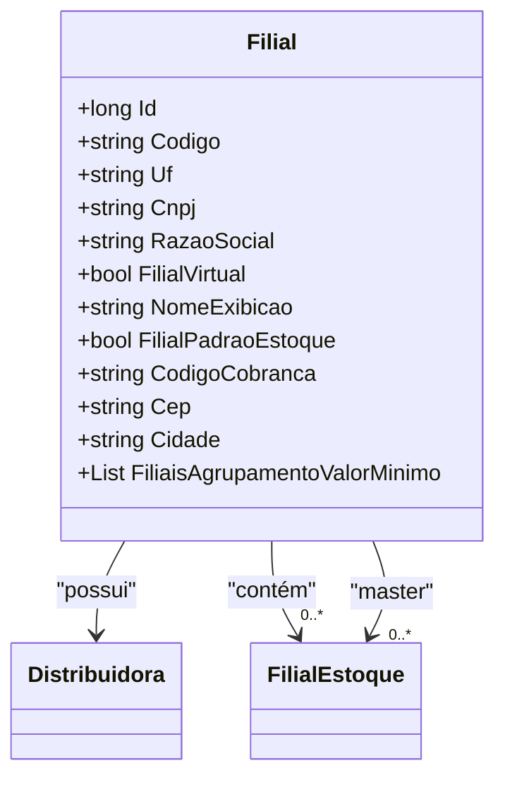

# Filial
**Namespace**: IsthmusWinthor.Dominio.Entidades  
**Nome do Arquivo**: Filial.cs  

## Visão Geral e Responsabilidade
A classe `Filial` representa uma filial em um sistema de gestão, garantindo a integridade e estruturação das informações pertinentes a cada unidade. Ela resolve o problema de negócios de gerenciar múltiplas filiais, cada uma com suas características específicas, como CNPJ, endereço e agrupamento de estoque, permitindo uma visão consolidada e organizada do funcionamento de cada filial dentro da distribuidora.

## Métodos de Negócio

### Título: FiliaisAgrupamentoValorMinimo
- **Visibilidade**: Público
- **Objetivo**: Este método assegura que os agrupamentos de filiais sejam armazenados e retornados de maneira consistente e sem duplicações, evitando confusões em operações de agregação de dados.
- **Comportamento**:
    1. Ao acessar a propriedade `FiliaisAgrupamentoValorMinimo`, tentamos desserializar a string `FiliaisAgrupamentoValorMinimoJson` em uma lista de strings.
    2. Se a string JSON estiver vazia ou nula, retornamos uma lista vazia.
    3. Convertendo todos os elementos da lista para maiúsculas para garantir uniformidade.
    4. Removendo duplicatas e o código da filial atual.
    5. Retornamos a lista resultante.
- **Retorno**: Retorna uma lista de strings contendo os códigos das filiais agrupadas, que não incluem a própria filial.

## Propriedades Calculadas e de Validação

### Propriedade: FiliaisAgrupamentoValorMinimo
- **Regra**: Esta propriedade é calculada e não armazenada diretamente na base de dados. Ela transforma uma string JSON em uma lista de strings que representa os códigos das filiais agrupadas, removendo duplicatas e evitando incluir o código da própria filial, assegurando integridade e consistência dos dados.

## Navigations Property
- [Distribuidora](Distribuidora.md)
- [FilialEstoque](FilialEstoque.md)
- [FiliaisEstoque](FiliaisEstoque.md)
- [FiliaisMaster](FiliaisMaster.md)

## Tipos Auxiliares e Dependências
- **Enums**: Nenhum enumerador utilizado.
- **Types**: 
  - [JsonConvert](https://www.newtonsoft.com/json) - Classe auxiliar para serialização/deserialização de JSON.

## Diagrama de Relacionamentos

---
Gerada em 29/12/2025 20:31:34
