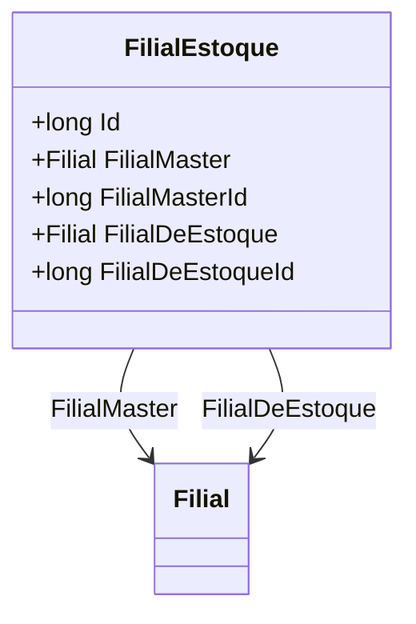

# FilialEstoque
- **Namespace**: IsthmusWinthor.Dominio.Entidades
- **Nome do Arquivo**: FilialEstoque.cs

## Visão Geral e Responsabilidade
A classe `FilialEstoque` representa a relação entre uma filial e seu estoque dentro do sistema. Ela estabelece a conexão entre uma filial (FilialMaster) que possui o estoque e uma filial (FilialDeEstoque) onde os produtos são armazenados. Esta estrutura é fundamental para gerenciar o fluxo de produtos entre diferentes localizações da empresa, garantindo que a distribuição e a gestão do estoque sejam realizadas de forma eficiente.

## Métodos de Negócio
No código apresentado, a classe `FilialEstoque` não contém métodos com lógica de negócio além dos simples getters e setters para as suas propriedades. Portanto, não há métodos a serem documentados nesta seção.

## Propriedades Calculadas e de Validação
A classe `FilialEstoque` não possui propriedades que implementem lógica adicional em seus getters ou validação em seus setters, uma vez que as propriedades são anêmicas e não contêm lógica fora da mera atribuição de valores.

## Navigations Property
- [Filial](Filial.md): Representa a filial mestre que possui o estoque.
- [Filial](Filial.md): Representa a filial onde o estoque é mantido.

## Tipos Auxiliares e Dependências
A classe `FilialEstoque` depende da classe `Filial`, que é esperada para representar uma entidade fundamental relacionada ao estoque. Não há enumeradores ou classes estáticas sendo utilizados nesta classe.

## Diagrama de Relacionamentos

Essa documentação reflete a estrutura e a funcionalidade da classe `FilialEstoque`, destacando sua importância na gestão de estoques dentro do sistema corporativo.
---
Gerada em 29/12/2025 20:31:43
