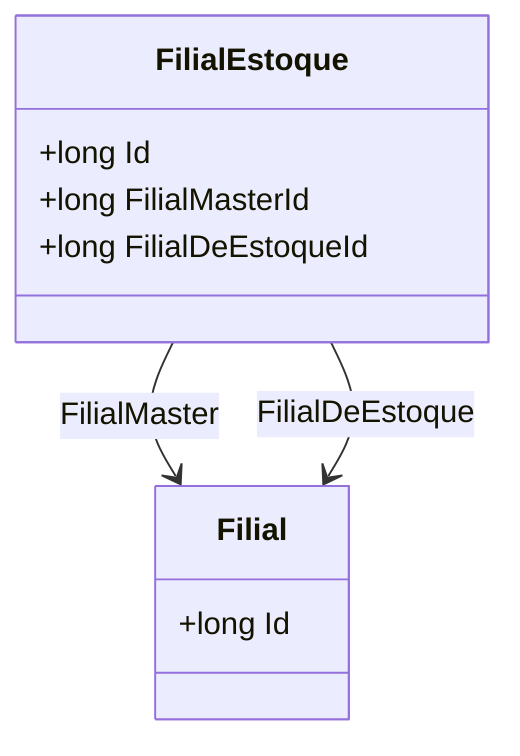

# FilialEstoque
**Namespace**: IsthmusWinthor.Dominio.Entidades  
**Nome do Arquivo**: FilialEstoque.cs  

## Visão Geral e Responsabilidade
A classe `FilialEstoque` representa uma entidade que configura a relação entre uma filial-mestre e uma filial onde o estoque é mantido. O problema de negócio que ela resolve é garantir que os dados de localização dos estoques estão corretamente associados a suas respectivas filiais, suportando a gestão eficiente de inventário e operações logísticas dentro de uma rede de filiais.

## Propriedades Calculadas e de Validação
Não existem propriedades que possuem lógica de cálculo ou validação nesta classe.

## Navigations Property
- `[Filial](Filial.md)` - Representa a Filial-mestre associada.
- `[Filial](Filial.md)` - Representa a Filial de Estoque onde os produtos estão armazenados.

## Tipos Auxiliares e Dependências
Não há enumeradores ou classes estáticas/utilitárias utilizadas diretamente nesta classe.

## Diagrama de Relacionamentos

