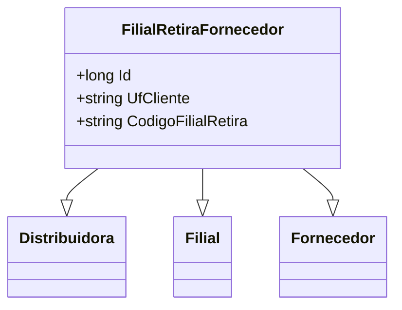

# FilialRetiraFornecedor
- **Namespace**: IsthmusWinthor.Dominio.Entidades
- **Nome do Arquivo**: FilialRetiraFornecedor.cs

## Visão Geral e Responsabilidade
A classe `FilialRetiraFornecedor` representa uma entidade de domínio que vincula informações entre filiais, distribuidores e fornecedores. Ela resolve o problema de associar fornecedores a filiais específicas que realizam retiradas, permitindo uma estrutura organizada para gerenciar as relações comerciais e logísticas entre esses elementos no sistema. 

## Métodos de Negócio
- **Título**: (Não há métodos com lógica de negócios implementados na presente classe)

## Propriedades Calculadas e de Validação
- **UfCliente**
  - Esta propriedade deverá conter a sigla da unidade federativa do cliente, que pode ser validada quanto à conformidade com os padrões de siglas estaduais brasileiros.
  
- **CodigoFilialRetira**
  - Representa um código específico da filial para processo de retirada. A lógica deve garantir que o código siga um padrão previamente definido pela organização, mas a validação não está explicitamente presente na propriedade.

## Navigations Property
- `[Distribuidora](Distribuidora.md)`
- `[Filial](Filial.md)`
- `[Fornecedor](Fornecedor.md)`

## Tipos Auxiliares e Dependências
- Utiliza a interface `[IEntidade](IEntidade.md)` para a definição da entidade.

## Diagrama de Relacionamentos

Esta documentação tem como objetivo fornecer uma visão clara sobre a classe `FilialRetiraFornecedor`, suas responsabilidades e como ela se relaciona com outras entidades no sistema, garantindo uma interpretação correta das regras de negócio envolvidas.
