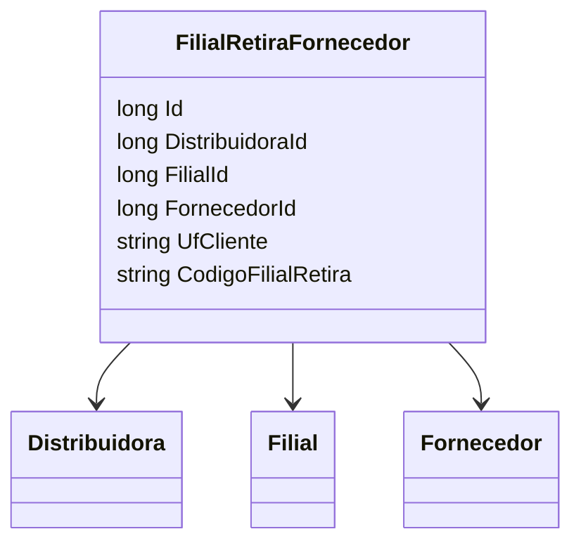

# FilialRetiraFornecedor
**Namespace**: IsthmusWinthor.Dominio.Entidades  
**Nome do Arquivo**: FilialRetiraFornecedor.cs  

## Visão Geral e Responsabilidade
A classe `FilialRetiraFornecedor` representa uma entidade do domínio que estabelece uma relação entre uma filial, um fornecedor e uma distribuidora. A sua principal responsabilidade é garantir que a informação sobre as filiais que retiram produtos de determinados fornecedores seja gerenciada de forma consistente, permitindo a operação eficiente do sistema e atendendo às necessidades logísticas de distribuição. Esta classe assegura que cada retirada de um fornecedor específico por uma filial está corretamente associada à distribuidora correspondente.

## Métodos de Negócio
Neste caso, a classe `FilialRetiraFornecedor` não apresenta métodos com lógica de negócio complexa, uma vez que possui somente propriedades e relacionamentos.

## Propriedades Calculadas e de Validação
Nesta classe, não foram identificadas propriedades que contêm lógica no `get` ou validação no `set`.

## Navigations Property
- **Distribuidora**: [Distribuidora](Distribuidora.md)
- **Filial**: [Filial](Filial.md)
- **Fornecedor**: [Fornecedor](Fornecedor.md)

## Tipos Auxiliares e Dependências
Não foram identificados enumeradores (Enums) ou classes estáticas/helpers utilizadas por esta classe.

## Diagrama de Relacionamentos

---
Gerada em 29/12/2025 20:31:50
