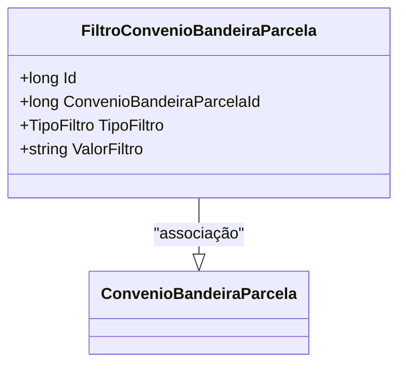

# FiltroConvenioBandeiraParcela
**Namespace**: IsthmusWinthor.Dominio.Entidades  
**Nome do Arquivo**: FiltroConvenioBandeiraParcela.cs  

## Visão Geral e Responsabilidade
A classe `FiltroConvenioBandeiraParcela` representa uma entidade que controla filtros aplicáveis a um convênio de bandeira de parcela. Sua principal responsabilidade é permitir a definição de parâmetros de filtragem que serão utilizados em consultas ou operações que envolvam as transações associadas a um convênio específico. Isso garante que os dados retornados correspondam às condições específicas requisitadas pelo usuário ou pela lógica de negócio.

## Métodos de Negócio
Esta classe não apresenta métodos com lógica de negócio complexa, funcionando essencialmente como uma estrutura de dados.

## Propriedades Calculadas e de Validação
- **ValorFiltro**: Esta propriedade pode conter regras de validação, dependendo do tipo de filtro aplicado (definido em `TipoFiltro`). O valor armazenado deve ser consistente com as condições para as quais o filtro está sendo utilizado, garantindo a integridade dos dados.

## Navigation Property
- **ConvenioBandeiraParcela**: Representa a associação com a classe complexa `ConvenioBandeiraParcela`.  
  [ConvenioBandeiraParcela](ConvenioBandeiraParcela.md)  

## Tipos Auxiliares e Dependências
- **Tipos de Filtro**: 
  - `[TipoFiltro](TipoFiltro.md)`: Enum que define os diferentes tipos de filtros que podem ser aplicados.

## Diagrama de Relacionamentos

