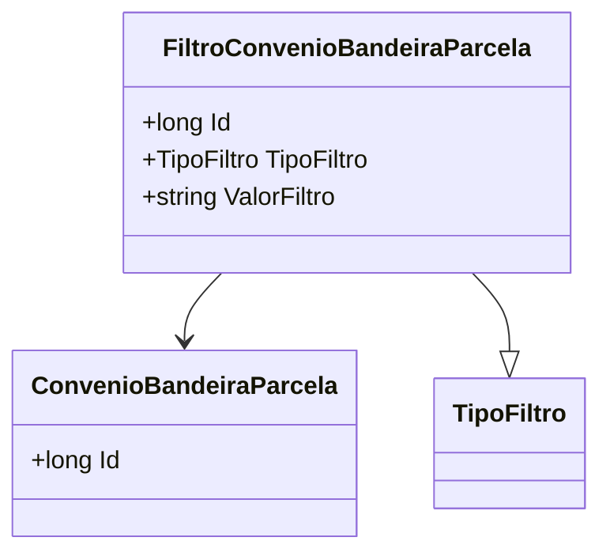

# FiltroConvenioBandeiraParcela
**Namespace**: IsthmusWinthor.Dominio.Entidades  
**Nome do Arquivo**: FiltroConvenioBandeiraParcela.cs  

## Visão Geral e Responsabilidade
A classe `FiltroConvenioBandeiraParcela` representa um filtro aplicado às entidades de convênios e suas respectivas bandeiras e parcelas dentro de um sistema corporativo. Ela permite que as regras de negócio associadas aos tipos de filtros e valores sejam utilizadas para personalizar e refinar as consultas, garantindo que os dados retornados estejam de acordo com critérios específicos definidos pelo usuário ou pela lógica do sistema.

## Métodos de Negócio
Nenhum método com lógica de negócio complexo foi identificado nesta classe.

## Propriedades Calculadas e de Validação
Nenhuma propriedade com lógica de cálculo ou validação foi identificada nesta classe.

## Navigations Property
- [ConvenioBandeiraParcela](ConvenioBandeiraParcela.md): Esta propriedade representa a classe complexa associada, que gerencia as informações de convênios, bandeiras e parcelas relacionadas.

## Tipos Auxiliares e Dependências
- [TipoFiltro](TipoFiltro.md): Enum utilizado para definir os tipos de filtro aplicáveis.

## Diagrama de Relacionamentos

---
Gerada em 29/12/2025 20:31:57
