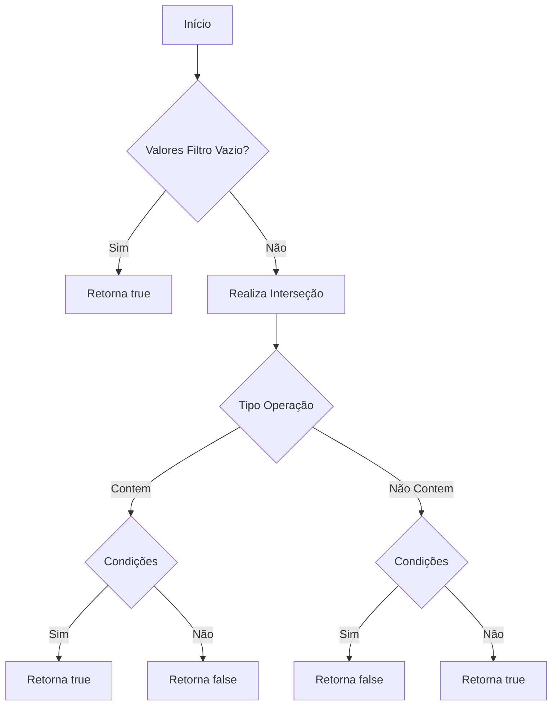
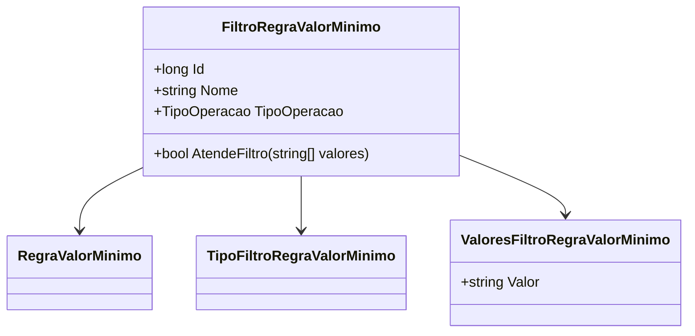

# FiltroRegraValorMinimo
**Namespace**: IsthmusWinthor.Dominio.Entidades  
**Nome do Arquivo**: FiltroRegraValorMinimo.cs  

## Visão Geral e Responsabilidade
A classe `FiltroRegraValorMinimo` atua como um mecanismo de filtragem para avaliar se um conjunto de valores atende a uma regra de negócio específica relacionada ao valor mínimo. Ela é responsável por garantir que os dados estejam em conformidade com determinadas operações de inclusão ou exclusão de valores, ajudando a manter a integridade das regras definidas no sistema.

## Métodos de Negócio

### Título: AtendeFiltro
- **Visibilidade**: Público

#### Objetivo:
Este método garante que um conjunto de valores atenda às condições definidas pela operação do filtro.

#### Comportamento:
1. Obtém todos os valores do filtro a partir da coleção `ValoresFiltroRegraValorMinimo`.
2. Se a lista de valores do filtro estiver vazia, retorna `true`, indicando que não há restrições.
3. Realiza uma interseção entre os valores do filtro e os valores fornecidos como parâmetro.
4. Avalia o resultado da interseção:
   - Se a operação do tipo for `Contem` (`TipoOperacao.Contem`), retorna `true` se haver pelo menos um valor correspondente.
   - Caso contrário, retorna `true` se nenhum dos valores do filtro estiver presente nos valores fornecidos.

#### Retorno:
Retorna um valor booleano que indica se os dados atendem ao filtro especificado.

## Propriedades Calculadas e de Validação
- Não há propriedades com lógica no `get` ou validação no `set`.

## Navigation Property
- [RegraValorMinimo](RegraValorMinimo.md)
- [TipoFiltroRegraValorMinimo](TipoFiltroRegraValorMinimo.md)
- [ValoresFiltroRegraValorMinimo](ValoresFiltroRegraValorMinimo.md)

## Tipos Auxiliares e Dependências
- [TipoOperacao](TipoOperacao.md) (Enumerador)

## Diagrama de Relacionamentos

---
Gerada em 29/12/2025 20:32:14
