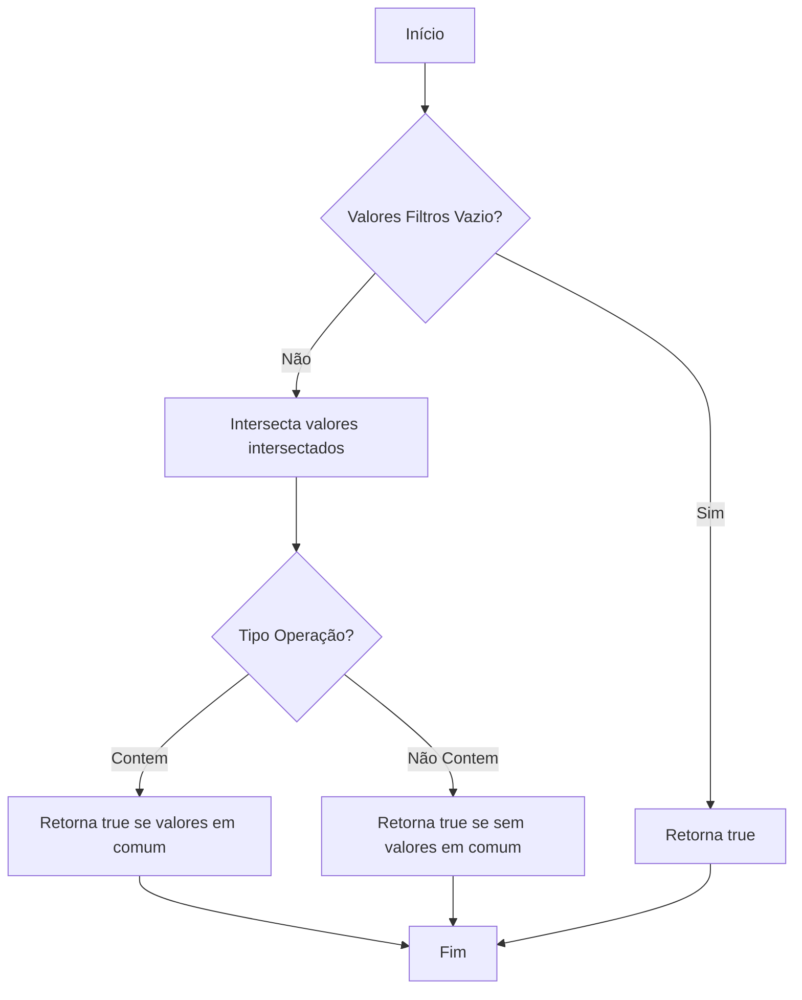
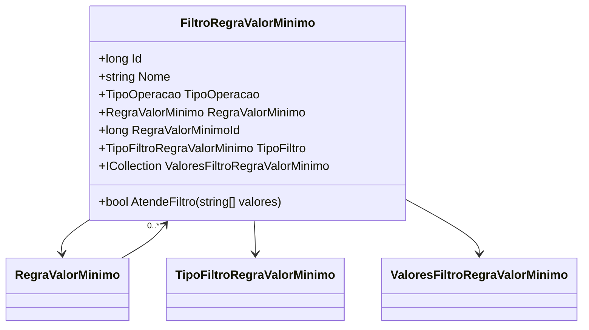

# FiltroRegraValorMinimo
**Namespace**: IsthmusWinthor.Dominio.Entidades  
**Nome do Arquivo**: FiltroRegraValorMinimo.cs  

## Visão Geral e Responsabilidade
A classe `FiltroRegraValorMinimo` atua como um componente que implementa regras de filtragem aplicadas a valores mínimos em um contexto específico. Sua principal função é determinar se um conjunto de valores fornecido atende a certos critérios definidos por regras de negócios, facilitando assim a aplicação de filtros dinâmicos em operações de validação e decisão.

## Métodos de Negócio

### Título: `AtendeFiltro` (public)
#### Objetivo
Garante que os valores fornecidos atendem ao critério de filtragem baseado no tipo de operação configurada. Este método ajuda a validar se a condição definida na regra de filtragem foi satisfeita.

#### Comportamento
1. Coleta todos os valores do filtro a partir da coleção `ValoresFiltroRegraValorMinimo` e os armazena em uma lista.
2. Se não houver valores na lista de filtros, o método retorna `true`, pois não existe critério a ser aplicado.
3. Realiza uma interseção entre os valores do filtro e os valores fornecidos como entrada.
4. Dependendo do tipo de operação (`TipoOperacao`), verifica se a interseção contém algum valor:
   - Se o tipo de operação for `Contem`, retorna `true` se houver valores em comum.
   - Se o tipo de operação for diferente, retorna `true` se não houver valores em comum.

#### Retorno
Retorna um valor booleano que indica se o conjunto de valores atende ou não ao critério de filtragem definido.

## Propriedades Calculadas e de Validação
- Nenhuma propriedade na classe `FiltroRegraValorMinimo` contém lógica de validação ou cálculo.

## Navigations Property
- `[RegraValorMinimo](RegraValorMinimo.md)`
- `[TipoFiltro](TipoFiltro.md)`
- `[ValoresFiltroRegraValorMinimo](ValoresFiltroRegraValorMinimo.md)`

## Tipos Auxiliares e Dependências
- `[TipoOperacao](TipoOperacao.md)`

## Diagrama de Relacionamentos

