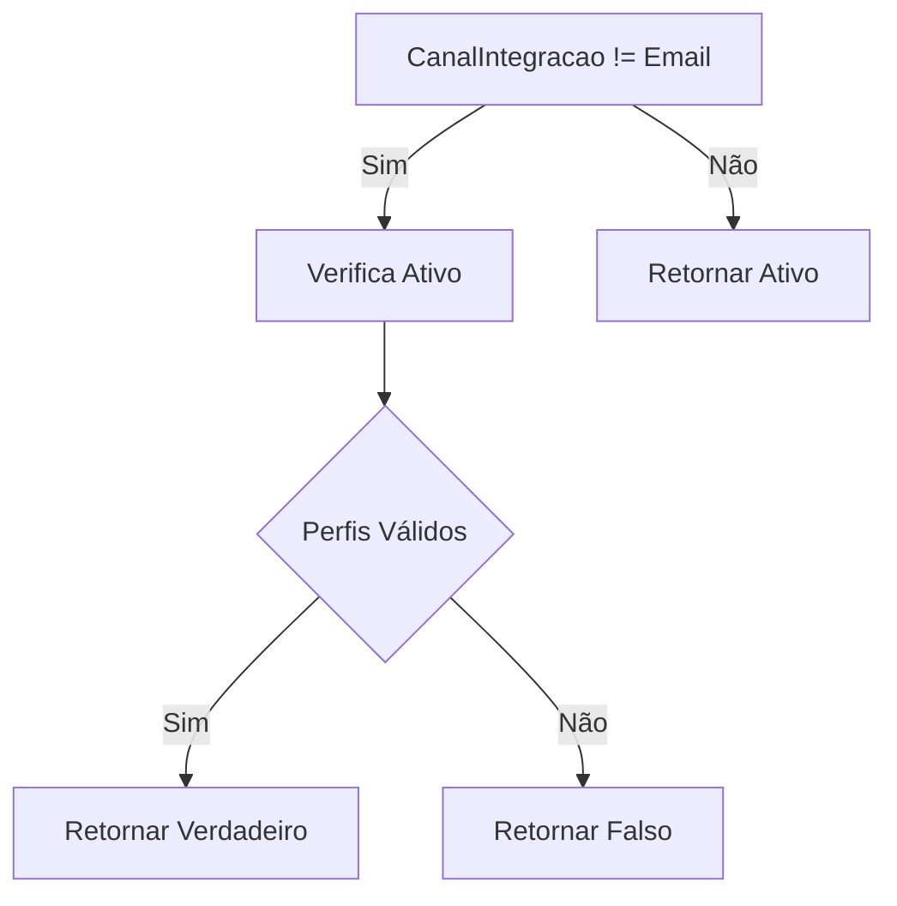
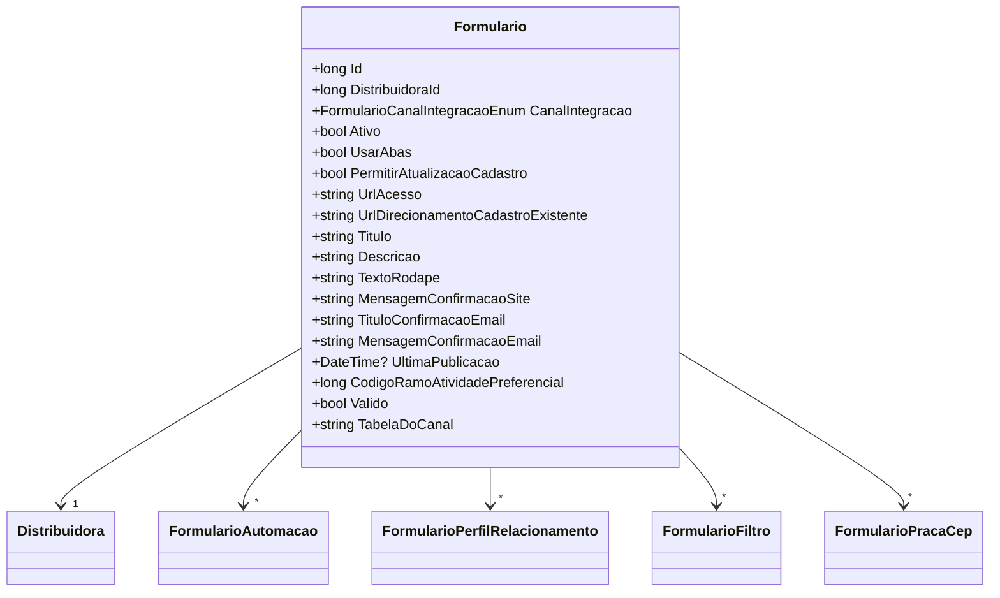

# Formulario
**Namespace**: IsthmusWinthor.Dominio.Entidades  
**Nome do Arquivo**: Formulario.cs  

## Visão Geral e Responsabilidade
A classe `Formulario` atua como uma entidade do domínio que representa um formulário dinâmico, associado a uma distribuidora. Seu papel é gerenciar as características e comportamentos de um formulário, incluindo integração com canais, automações, perfis, filtros e configurações de publicação. A classe resolve o problema de permitir que os usuários customizem e acessem formulários de maneira eficiente, considerando as especificidades do canal de integração e as permissões relacionadas.

## Métodos de Negócio

### 1. `Valido` (Propriedade - get)
- **Objetivo:** Garante que o formulário é considerado válido. 
- **Comportamento:**
  1. Se o `CanalIntegracao` não for configurado como `Email`, verifica se o formulário está ativo (`Ativo`).
  2. Além disso, deve haver pelo menos um perfil ativo e padrão (`FormularioPerfil.Padrao && FormularioPerfil.Ativo`).
  3. Se o `CanalIntegracao` for `Email`, somente a propriedade `Ativo` é verificada.
- **Retorno:** Retorna um valor booleano que indica se o formulário é considerado válido ou não.

### 2. `TabelaDoCanal` (Propriedade - get)
- **Objetivo:** Retorna o nome da tabela correspondente ao canal de integração configurado. 
- **Comportamento:** Utiliza a classe auxiliar `FormularioCanalIntegracaoTabela` para determinar a tabela associada ao `CanalIntegracao` por meio do método estático `TabelaDoCanal(CanalIntegracao)`.
- **Retorno:** Retorna uma string representando o nome da tabela correspondente ao canal de integração.

## Propriedades Calculadas e de Validação

### `Valido`
- A propriedade `Valido` contém lógica de validação que assegura que o formulário é ativo e possui perfis válidos, dependendo do tipo de canal de integração.

## Navigation Property
- `[Distribuidora](Distribuidora.md)`
- `[FormularioAutomacao](FormularioAutomacao.md)`
- `[FormularioPerfilRelacionamento](FormularioPerfilRelacionamento.md)`
- `[FormularioFiltro](FormularioFiltro.md)`
- `[FormularioPracaCep](FormularioPracaCep.md)`

## Tipos Auxiliares e Dependências
- `[FormularioCanalIntegracaoEnum](FormularioCanalIntegracaoEnum.md)`
- `[FormularioCanalIntegracaoTabela](FormularioCanalIntegracaoTabela.md)`

## Diagrama de Relacionamentos

