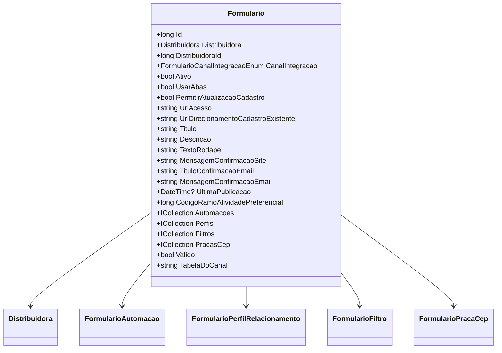

# Formulario
**Namespace**: IsthmusWinthor.Dominio.Entidades  
**Nome do Arquivo**: Formulario.cs  

## Visão Geral e Responsabilidade
A classe `Formulario` representa um formulário dinâmico que pode ser utilizado por diferentes distribuidoras para coletar informações de usuários. Este modelo garante que a integração do formulário com diversos canais de comunicação e a automação associada a ele sejam geridas de forma eficiente. A classe provê funcionalidades para ativar/desativar o formulário, definir suas características e interações com usuários, além de validar se o formulário é capaz de ser utilizado em função das suas configurações.

## Métodos de Negócio

### 1. Valido: get
- **Objetivo**: Garante se o formulário é considerado válido para uso com base na configuração atual.
- **Comportamento**:
  1. Se o `CanalIntegracao` for diferente de `Email`, o método verifica se o formulário está `Ativo`.
  2. Além disso, deve haver pelo menos um perfil ativo e padrão vinculado ao formulário.
  3. Se o canal for `Email`, apenas a propriedade `Ativo` é considerada.
- **Retorno**: Retorna um valor booleano (`true` ou `false`) indicando se o formulário é válido conforme as condições descritas.

```mermaid
flowchart TD
    A[CanalIntegracao != Email]
    A -- Yes --> B[Ativo == true]
    B --> C[Perfis.Any(p => p.FormularioPerfil.Padrao && p.FormularioPerfil.Ativo)]
    C -- Yes --> D[return true]
    C -- No --> D2[return false]
    A -- No --> E[return Ativo]
```

### 2. TabelaDoCanal: get
- **Objetivo**: Retorna a tabela correspondente ao canal de integração configurado.
- **Comportamento**:
  1. A propriedade chama um método estático `TabelaDoCanal` do `FormularioCanalIntegracaoTabela` passando o `CanalIntegracao`.
- **Retorno**: Retorna uma string que representa a tabela do canal correspondente ao tipo de integração.

## Propriedades Calculadas e de Validação

### Propriedade: Valido
- **Regra**: A validade do formulário depende de sua ativação e configuração de perfis, apresentando uma lógica condicional para verificar se pode ser utilizado, dependendo do canal de integração.

### Propriedade: TabelaDoCanal
- **Regra**: Define a tabela baseada no tipo de canal de integração, garantindo que a estrutura dos dados coletados esteja alinhada com a necessidade do canal especificado.

## Navigation Property
- [Distribuidora](Distribuidora.md) - Representa a distribuidora associada ao formulário.
- [FormularioAutomacao](FormularioAutomacao.md) - Representa as automações relacionadas ao formulário.
- [FormularioPerfilRelacionamento](FormularioPerfilRelacionamento.md) - Vincula perfis de relacionamento ao formulário.
- [FormularioFiltro](FormularioFiltro.md) - Filtros que podem ser aplicados ao formulário.
- [FormularioPracaCep](FormularioPracaCep.md) - Representa informações de locais específicos associados ao formulário.

## Tipos Auxiliares e Dependências
- [FormularioCanalIntegracaoEnum](FormularioCanalIntegracaoEnum.md) - Enum que define os tipos de canais de integração disponíveis.
- [FormularioCanalIntegracaoTabela](FormularioCanalIntegracaoTabela.md) - Classe auxiliar para ler as tabelas associadas aos canais de integração.

## Diagrama de Relacionamentos

---
Gerada em 29/12/2025 20:32:41
