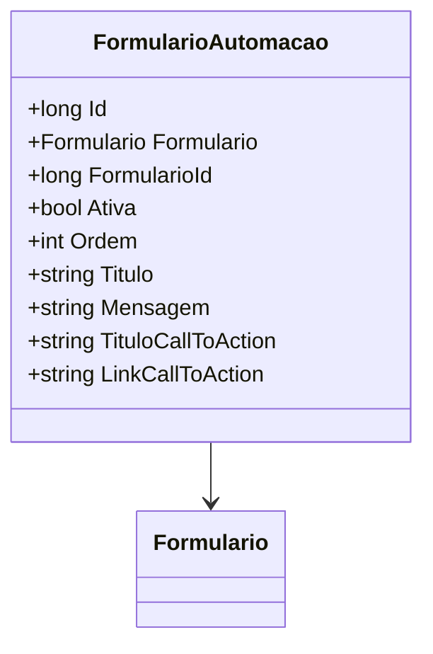

# FormularioAutomacao
**Namespace**: IsthmusWinthor.Dominio.Entidades  
**Nome do Arquivo**: FormularioAutomacao.cs  

## Visão Geral e Responsabilidade
A classe `FormularioAutomacao` representa um modelo de automação de formulário, que serve para gerenciar e configurar o comportamento de um formulário automatizado na aplicação. O principal problema de negócio que esta classe resolve é a necessidade de manter o estado e a configuração das automações de formulários de forma organizada, permitindo que os usuários interajam com o sistema de forma mais eficiente através de mensagens e chamadas à ação dinâmicas.

## Métodos de Negócio
*(Observação: a classe não possui métodos com lógica de negócio além de getters/setters normais.)*

## Propriedades Calculadas e de Validação
- `Ativa`: Esta propriedade determina se o formulário de automação está ativo ou não. É crucial para a lógica de apresentação e interação do usuário, onde um formulário inativo não deve ser mostrado ao usuário.
- `Ordem`: A propriedade `Ordem` define a sequência dos formulários de automação apresentados, garantindo que os formulários sejam exibidos na ordem correta para o usuário.

## Navigations Property
- [`Formulario`](Formulario.md): Representa a classe associada ao formulário que está sendo automatizado.

## Tipos Auxiliares e Dependências
- Nenhum enumerador ou classe estática/auxiliar é utilizado nesta classe.

## Diagrama de Relacionamentos

