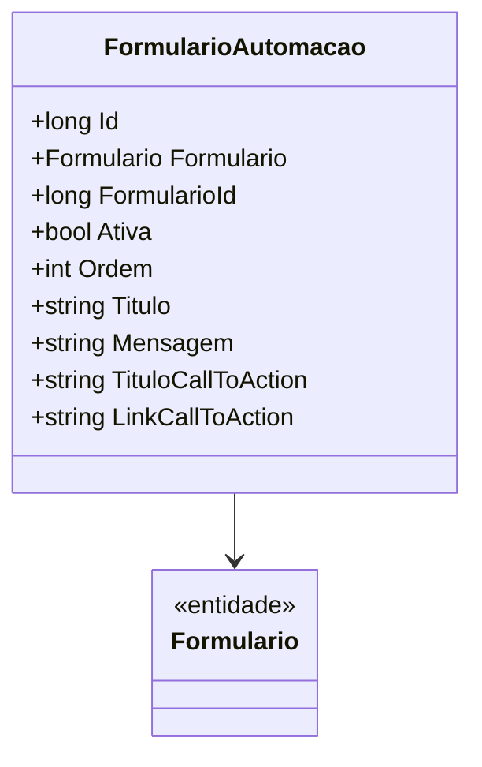

# FormularioAutomacao
**Namespace**: IsthmusWinthor.Dominio.Entidades  
**Nome do Arquivo**: FormularioAutomacao.cs  

## Visão Geral e Responsabilidade
A classe `FormularioAutomacao` é a representação de um formulário automatizado dentro do domínio do sistema, responsável por gerenciar as configurações e estados desse formulário. O problema de negócio que ela resolve está relacionado ao controle e personalização dos formulários que podem ser utilizados em processos automatizados, permitindo que uma configuração detalhada do formulário interfira diretamente na experiência do usuário e na coleta de dados.

## Propriedades Calculadas e de Validação
Não há propriedades com lógica de cálculo ou validação no `get` ou `set`.

## Navigations Property
- [Formulario](Formulario.md) - Esta propriedade representa um formulário associado a esta automação, permitindo que a classe `FormularioAutomacao` seja vinculada a estruturas mais complexas do domínio.

## Tipos Auxiliares e Dependências
- Nenhum enumerador ou classe estática/helper é utilizado diretamente nesta classe.

## Diagrama de Relacionamentos

---
Gerada em 29/12/2025 20:32:47
