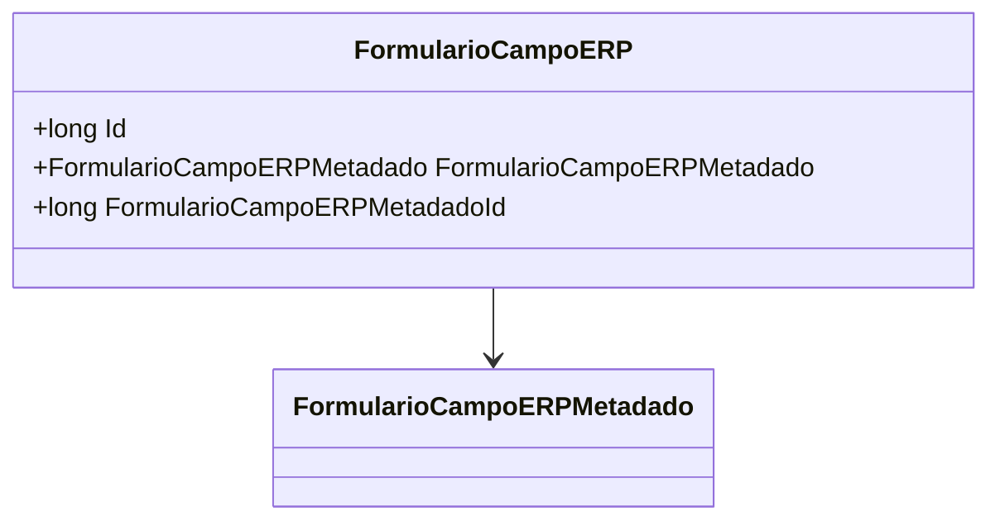

# FormularioCampoERP

**Namespace**: IsthmusWinthor.Dominio.Entidades  
**Nome do Arquivo**: FormularioCampoERP.cs

## Visão Geral e Responsabilidade
A classe `FormularioCampoERP` representa um campo de um formulário dentro de um sistema ERP (Enterprise Resource Planning). Esta classe é responsável por armazenar as informações associadas aos metadados de um campo de formulário específico, criando uma relação entre o campo e suas características, representadas pela classe `FormularioCampoERPMetadado`. Ela limita a integridade e a consistência dos dados relacionados a formulários, garantindo que os campos sejam sempre associados aos seus metadados corretos.

## Navegação Property
- `[FormularioCampoERPMetadado](FormularioCampoERPMetadado.md)`: Refere-se à metainformação do campo, que documenta suas propriedades e características.

## Tipos Auxiliares e Dependências
- **Interface**: `[IEntidade](IEntidade.md)`: Interface que representa uma entidade no domínio, da qual `FormularioCampoERP` herda.
- **Metadados**: A classe `[FormularioCampoERPMetadado](FormularioCampoERPMetadado.md)` é uma dependência direta, fornecendo a estrutura de metadados que define o comportamento do campo.

## Diagrama de Relacionamentos

