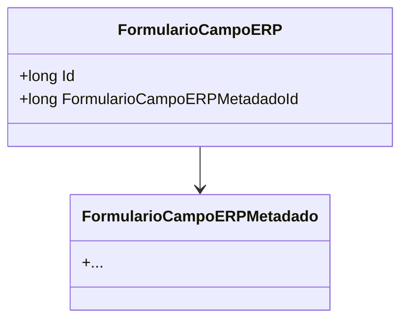

# FormularioCampoERP
**Namespace**: IsthmusWinthor.Dominio.Entidades  
**Nome do Arquivo**: FormularioCampoERP.cs  

## Visão Geral e Responsabilidade
A classe `FormularioCampoERP` representa uma entidade que faz parte do domínio dos formulários dentro do sistema ERP. Esta classe tem a responsabilidade de estruturar e mapear as informações dos campos do formulário, gerenciando a relação entre os metadados do campo e a própria entidade de campo. O problema de negócio que a classe resolve é a necessidade de garantir a integridade e a vinculação entre os dados dos campos do formulário e suas definições (metadados), assegurando que cada campo tenha um metadado associado do tipo `FormularioCampoERPMetadado`.

## Propriedades Calculadas e de Validação
- Não foram identificadas propriedades com lógica no `get` ou validação no `set`.

## Navigations Property
- [FormularioCampoERPMetadado](FormularioCampoERPMetadado.md)

## Tipos Auxiliares e Dependências
- Não foram identificados Enumeradores ou Classes Estáticas/Helpers utilizadas pela classe.

## Diagrama de Relacionamentos

---
Gerada em 29/12/2025 20:32:54
