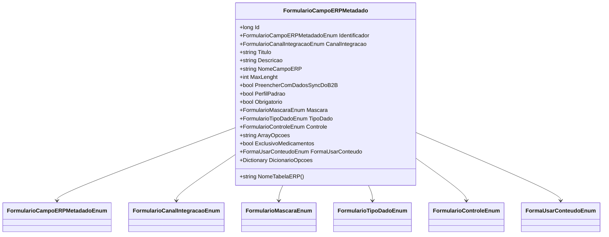

# FormularioCampoERPMetadado
- **Namespace**: IsthmusWinthor.Dominio.Entidades
- **Nome do Arquivo**: FormularioCampoERPMetadado.cs

## Visão Geral e Responsabilidade
A classe `FormularioCampoERPMetadado` representa a definição de um campo de um formulário dentro de um sistema de integração ERP. Sua principal responsabilidade é armazenar metadados que determinam como os dados devem ser estruturados e tratados ao serem integrados a um sistema ERP, facilitando a captura e o envio de informações entre sistemas.

## Métodos de Negócio

### NomeTabelaERP
- **Visibilidade**: Público
- **Objetivo**: Fornecer o nome da tabela correspondente ao canal de integração configurado para o campo do formulário.
- **Comportamento**: 
   1. Chama o método estático `TabelaDoCanal` da classe `FormularioCanalIntegracaoTabela`.
   2. Passa como argumento o valor do canal de integração (`CanalIntegracao`) do campo atual.
   3. Retorna o nome da tabela correspondente ao canal.
- **Retorno**: Retorna uma string que representa o nome da tabela ERP, onde os dados deste campo serão armazenados.

## Propriedades Calculadas e de Validação

### FormaUsarConteudo
- **Regra de Cálculo**: Esta propriedade avalia se o `NomeCampoERP` contém um ponto e vírgula (`;`). Se contiver, a forma de usar o conteúdo será definida como `Dividir`; caso contrário, será `Unico`.

### DicionarioOpcoes
- **Regra de Cálculo**: Converte a propriedade `ArrayOpcoes`, que contém um array no formato de string, em um dicionário de pares chave-valor. Isto é realizado chamando um método de extensão que transforma essa string em um dicionário.

## Navigations Property
- Não existem propriedades que são classes complexas do domínio nesta classe.

## Tipos Auxiliares e Dependências
- **Enumeradores**:
  - `[FormularioCampoERPMetadadoEnum](FormularioCampoERPMetadadoEnum.md)`
  - `[FormularioCanalIntegracaoEnum](FormularioCanalIntegracaoEnum.md)`
  - `[FormularioMascaraEnum](FormularioMascaraEnum.md)`
  - `[FormularioTipoDadoEnum](FormularioTipoDadoEnum.md)`
  - `[FormularioControleEnum](FormularioControleEnum.md)`
  - `[FormaUsarConteudoEnum](FormaUsarConteudoEnum.md)`

## Diagrama de Relacionamentos

