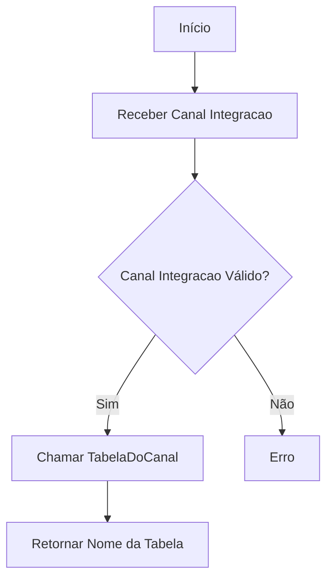
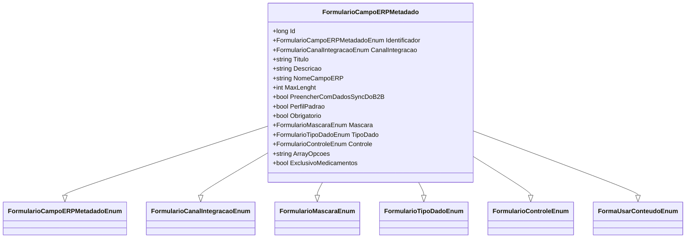

# FormularioCampoERPMetadado
**Namespace**: IsthmusWinthor.Dominio.Entidades  
**Nome do Arquivo**: FormularioCampoERPMetadado.cs  

## Visão Geral e Responsabilidade
A classe `FormularioCampoERPMetadado` representa a estrutura de metadados associada a campos em um formulário ERP, definindo atributos e comportamentos que garantem a integridade e coesão dos dados no processo de integração com sistemas ERP. Esta classe resolve problemas relacionados à configuração e definição dos campos do formulário, assegurando que as informações sejam coletadas de maneira adequada e consistente, respeitando regras de negócio específicas.

## Métodos de Negócio

### NomeTabelaERP (Public)
- **Objetivo**: Este método determina o nome da tabela ERP associada ao canal de integração especificado.
- **Comportamento**: 
  1. Recebe a propriedade `CanalIntegracao` como entrada.
  2. Chama o método estático `TabelaDoCanal` da classe `FormularioCanalIntegracaoTabela`, passando `CanalIntegracao` para obter o nome da tabela correspondente.
- **Retorno**: Retorna uma string que representa o nome da tabela ERP associada ao canal de integração.

## Propriedades Calculadas e de Validação

### FormaUsarConteudo
- **Regra**: Esta propriedade avalia se o `NomeCampoERP` contém um delimitador (“;”). Se sim, indica que o conteúdo deve ser dividido; caso contrário, considerará o conteúdo como único. 
- **Cálculo**: 
  - Se `NomeCampoERP` não for nulo ou vazio e contiver ";", retorna `FormaUsarConteudoEnum.Dividir`.
  - Caso contrário, retorna `FormaUsarConteudoEnum.Unico`.

### DicionarioOpcoes
- **Regra**: Esta propriedade cria um dicionário a partir de uma string `ArrayOpcoes`, convertendo as opções definidas em um formato de dicionário chave-valor. 
- **Cálculo**: Chama o método `ToDictionary` na classe `FormularioCampoOpcoesArray`, passando `ArrayOpcoes` para geração do dicionário.

## Navigations Property
- Nenhuma propriedade de navegação complexa foi identificada nesta classe.

## Tipos Auxiliares e Dependências
- [FormularioCampoERPMetadadoEnum](FormularioCampoERPMetadadoEnum.md)
- [FormularioCanalIntegracaoEnum](FormularioCanalIntegracaoEnum.md)
- [FormularioMascaraEnum](FormularioMascaraEnum.md)
- [FormularioTipoDadoEnum](FormularioTipoDadoEnum.md)
- [FormularioControleEnum](FormularioControleEnum.md)
- [FormaUsarConteudoEnum](FormaUsarConteudoEnum.md)
- [FormularioCampoOpcoesArray](FormularioCampoOpcoesArray.md)
- [FormularioCanalIntegracaoTabela](FormularioCanalIntegracaoTabela.md)

## Diagrama de Relacionamentos

---
Gerada em 29/12/2025 20:33:21
