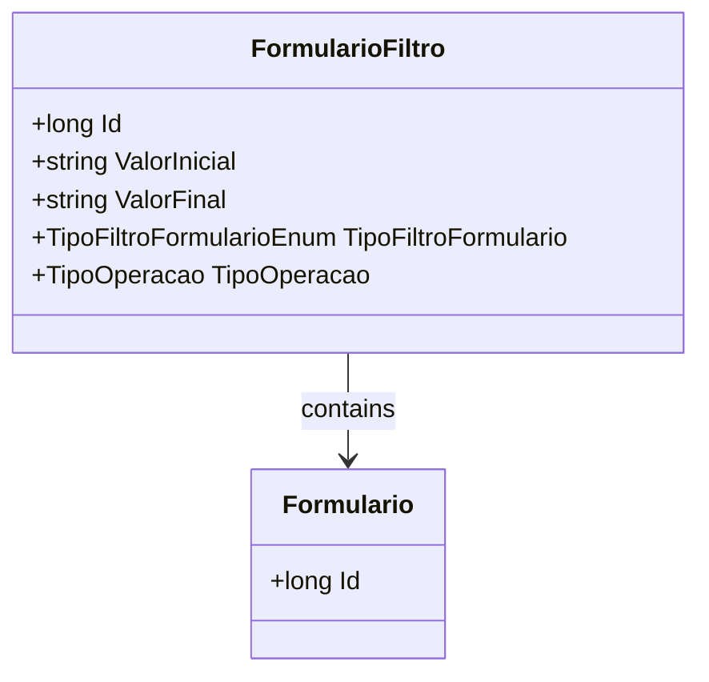

# FormularioFiltro
**Namespace**: IsthmusWinthor.Dominio.Entidades  
**Nome do Arquivo**: FormularioFiltro.cs  

## Visão Geral e Responsabilidade
A classe `FormularioFiltro` atua como um agregador de informações para estabelecer critérios de filtros a serem aplicados em formulários de dados. Seu objetivo é permitir a filtragem eficaz de informações, definindo intervalos e tipos de operações que podem ser utilizados na consulta de dados, ajudando os usuários a encontrar informações relevantes de forma mais eficiente.

## Métodos de Negócio
Nenhum método com lógica complexa foi identificado nesta classe. Todos os métodos adicionais que possam ser implementados devem seguir as regras de negócio estabelecidas.

## Propriedades Calculadas e de Validação
Nenhuma propriedade com lógica no `get` ou validação no `set` foi identificada nesta classe. Todas as propriedades são simples e armazenam dados diretamente.

## Navigations Property
- `[Formulario](Formulario.md)`: Propriedade que representa o formulário associado ao filtro.

## Tipos Auxiliares e Dependências
- `[TipoFiltroFormularioEnum](TipoFiltroFormularioEnum.md)`: Enumerador utilizado para categorizar o tipo de filtro do formulário.
- `[TipoOperacao](TipoOperacao.md)`: Classe utilizada para definir tipos de operações que podem ser aplicadas ao filtro.

## Diagrama de Relacionamentos

