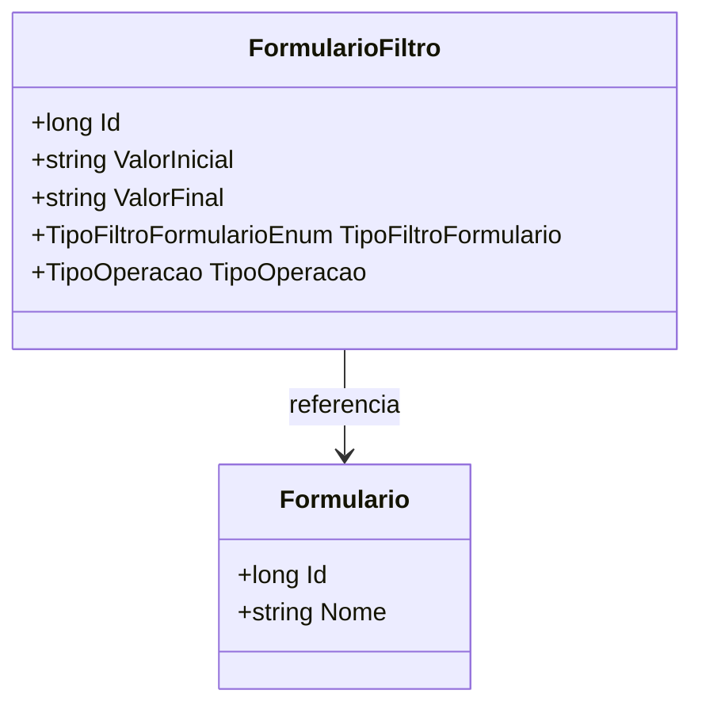

# FormularioFiltro
**Namespace**: IsthmusWinthor.Dominio.Entidades  
**Nome do Arquivo**: FormularioFiltro.cs

## Visão Geral e Responsabilidade
A classe `FormularioFiltro` representa um filtro aplicável a um formulário, permitindo que os usuários definam critérios específicos para a recuperação de dados. Ela é responsável por encapsular as condições que devem ser atendidas durante a consulta, auxiliando no processo de filtragem de informações com base em parâmetros como valores iniciais e finais, tipo de filtro e tipo de operação. Essa estrutura é fundamental para garantir que os dados retornados estejam dentro dos critérios estipulados, alinhando-se às necessidades de relatórios e análise.

## Métodos de Negócio
*Nenhum método com lógica complexa foi identificado nesta classe. A classe `FormularioFiltro` consiste principalmente em propriedades, sem métodos que implementem regras de negócio, além de getters e setters simples.*

## Propriedades Calculadas e de Validação
*Nenhuma propriedade calculada ou de validação foi identificada nesta classe.*

## Navigations Property
- [Formulario](Formulario.md)

## Tipos Auxiliares e Dependências
- [TipoFiltroFormularioEnum](TipoFiltroFormularioEnum.md)
- [TipoOperacao](TipoOperacao.md)

## Diagrama de Relacionamentos

---
Gerada em 29/12/2025 20:33:28
