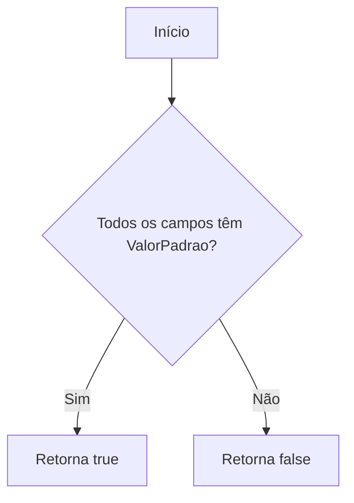
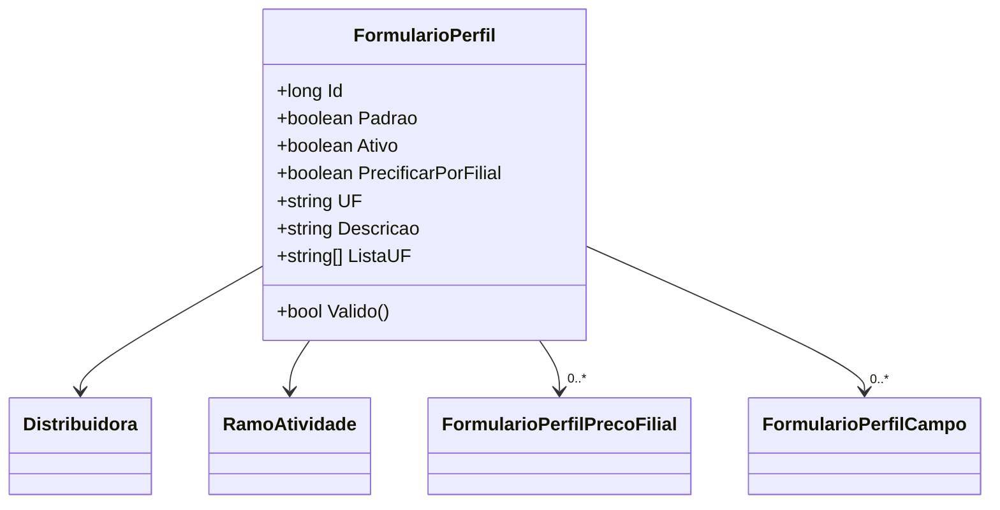

# FormularioPerfil
**Namespace**: IsthmusWinthor.Dominio.Entidades  
**Nome do Arquivo**: FormularioPerfil.cs  

## Visão Geral e Responsabilidade
A classe `FormularioPerfil` atua como um modelo de domínio que encapsula as regras de negócio relacionadas ao perfil de um formulário dentro do contexto de uma distribuidora. Esta classe é responsável por agregar informações relevantes, incluindo a distribuidora, as atividades de ramo e propriedades que definem a configuração do formulário. O objetivo principal é assegurar que os dados dos formulários sejam válidos e que a precificação e a descrição sejam geridas eficientemente.

## Métodos de Negócio

### Método: Valido (public)
- **Objetivo**: Este método garante que todos os campos associados ao formulário tenham um valor padrão definido, assegurando assim a integridade e a completude dos dados.
- **Comportamento**: 
  1. O método verifica `this.Campos`, que é uma coleção de `FormularioPerfilCampo`.
  2. Utiliza o método `All` para iterar sobre cada campo na coleção.
  3. Para cada campo, verifica se a propriedade `ValorPadrao` não é nula ou vazia.
  4. Retorna `true` se todos os campos tiverem valores válidos; caso contrário, retorna `false`.
- **Retorno**: Retorna um `bool`. `true` se todos os campos têm um `ValorPadrao` válido; `false` caso contrário.

### Visualização

## Propriedades Calculadas e de Validação

### Propriedade: ListaUF
- **Regra**: Esta propriedade calcula um array de strings representando os estados (UF) a partir de uma string armazenada na propriedade `UF`. Se a string estiver vazia, retorna um array vazio. Caso contrário, a string é dividida em partes, filtrada para remover entradas nulas ou vazias, e ordenada alfabeticamente.

## Navigations Property
- [`Distribuidora`](Distribuidora.md)
- [`RamoAtividade`](RamoAtividade.md)
- [`FormularioPerfilPrecoFilial`](FormularioPerfilPrecoFilial.md)
- [`FormularioPerfilCampo`](FormularioPerfilCampo.md)

## Tipos Auxiliares e Dependências
- [`FormularioCanalIntegracaoEnum`](FormularioCanalIntegracaoEnum.md)

## Diagrama de Relacionamentos

