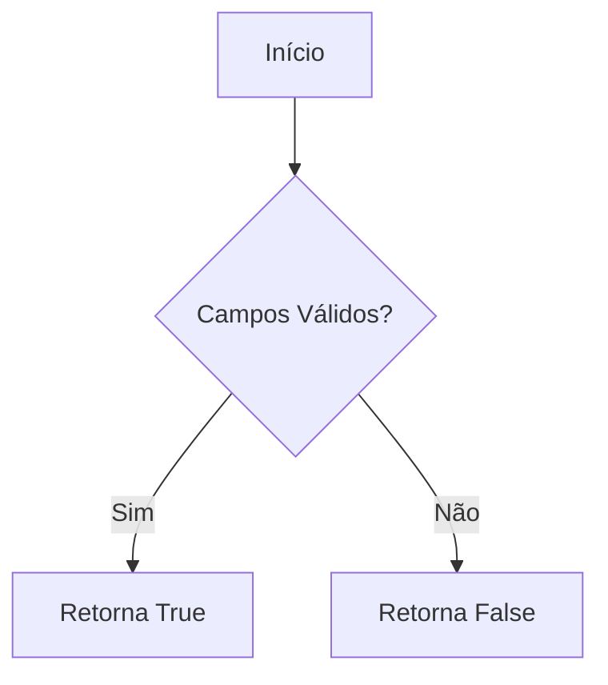
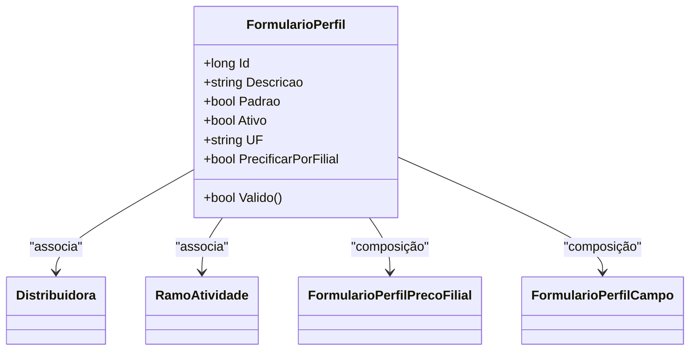

# FormularioPerfil
**Namespace**: IsthmusWinthor.Dominio.Entidades  
**Nome do Arquivo**: FormularioPerfil.cs  

## Visão Geral e Responsabilidade
A classe `FormularioPerfil` atua como uma entidade do domínio que gerencia as configurações de formulários de perfis para diferentes `Distribuidoras`. Esta classe é responsável por assegurar que os dados necessários para a configuração e precificação de produtos estejam completos e válidos, permitindo a integração e personalização da experiência do usuário com a plataforma.

## Métodos de Negócio

### Método: Valido() - `public`
- **Objetivo**: Garante que todos os campos do formulário tenham um valor padrão válido. Isso é fundamental para a integridade dos dados antes de processar ou salvar o formulário.
- **Comportamento**: 
  1. Acessa a coleção de campos (`Campos`) associados ao formulário.
  2. Verifica se todos os campos possuem um valor não nulo ou não vazio (`ValorPadrao`).
  3. Retorna `true` se todos os valores forem válidos, ou `false` caso contrário.
- **Retorno**: Retorna um valor booleano que indica se os campos do formulário estão válidos para prosseguir com operações que dependam deles.

## Propriedades Calculadas e de Validação

### Propriedade: ListaUF
- **Regra**: Esta propriedade fornece uma lista de Unidade Federativa (UF) a partir da string `UF`, separando-a por vírgulas. A lógica garante que a saída é um array de strings sem elementos vazios e ordenado alfabeticamente.
  
## Navigations Property
- [Distribuidora](Distribuidora.md)
- [RamoAtividade](RamoAtividade.md)
- [FormularioPerfilPrecoFilial](FormularioPerfilPrecoFilial.md)
- [FormularioPerfilCampo](FormularioPerfilCampo.md)

## Tipos Auxiliares e Dependências
- [FormularioCanalIntegracaoEnum](FormularioCanalIntegracaoEnum.md)

## Diagrama de Relacionamentos

---
Gerada em 29/12/2025 20:33:43
