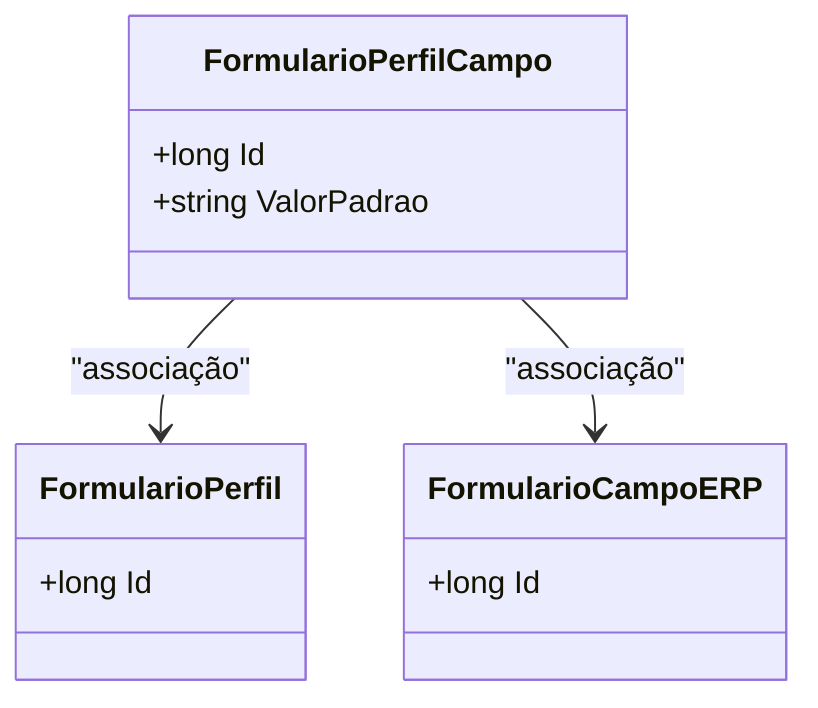

# FormularioPerfilCampo
**Namespace**: IsthmusWinthor.Dominio.Entidades  
**Nome do Arquivo**: FormularioPerfilCampo.cs  

## Visão Geral e Responsabilidade
A classe `FormularioPerfilCampo` representa a associação entre um perfil de formulário e um campo específico do ERP. O objetivo desta classe é garantir que cada campo que faz parte do perfil do formulário possa armazenar um valor padrão. Essa funcionalidade é fundamental para a configuração dinâmica de formulários, onde diferentes perfis podem ter campos personalizados com valores predefinidos, garantindo que os dados capturados sejam consistentes e adequados para a aplicação de negócio.

## Navegações
- [FormularioPerfil](FormularioPerfil.md): Classe que representa a raiz do perfil do formulário.
- [FormularioCampoERP](FormularioCampoERP.md): Classe que representa o campo específico do ERP.

## Tipos Auxiliares e Dependências
- Nenhum Enumerador ou Classe Estática/Helper foi identificado na classe `FormularioPerfilCampo`.

## Diagrama de Relacionamentos

---
Gerada em 29/12/2025 20:33:53
