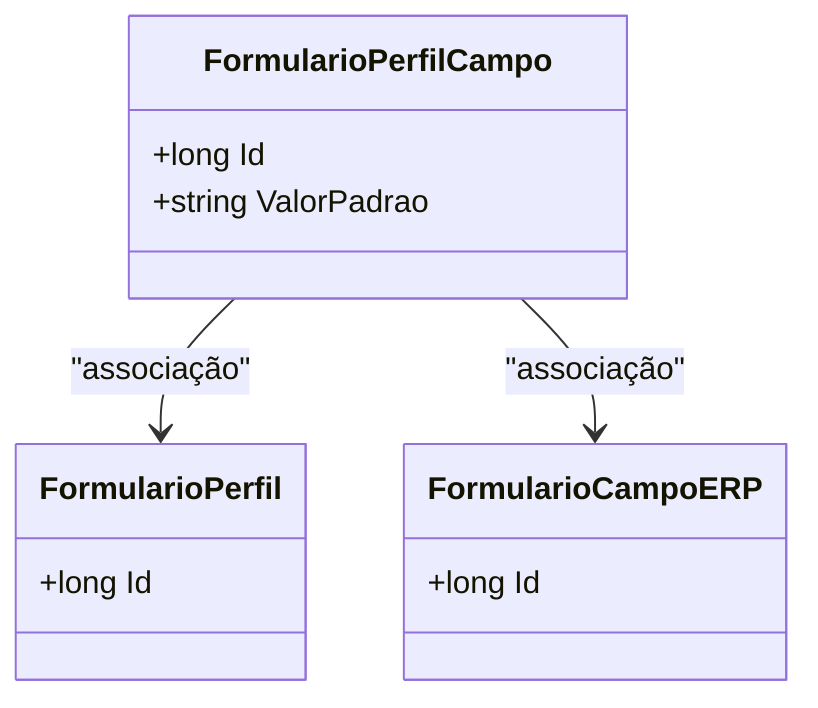

# FormularioPerfilCampo
**Namespace**: IsthmusWinthor.Dominio.Entidades  
**Nome do Arquivo**: FormularioPerfilCampo.cs  

## Visão Geral e Responsabilidade
A classe `FormularioPerfilCampo` representa a conexão entre um perfil de formulário e os campos vinculados a ele. Seu papel é garantir que as informações relacionadas aos campos dos formulários sejam devidamente associadas a cada perfil, permitindo que os dados sejam capturados, armazenados e manipulados conforme as necessidades do negócio. Essa classe se insere em um contexto onde diferentes perfis de usuários podem ter suas próprias configurações de campos, essencial para a personalização da experiência do usuário.

## Métodos de Negócio
*Não há métodos com lógica complexa a serem documentados nesta classe.*

## Propriedades Calculadas e de Validação
- **ValorPadrao**: Esta propriedade armazena um valor padrão que pode ser utilizado nos campos do formulário para garantir a integridade e consistência dos dados. A regra de negócios associada à esse campo é que, se o valor padrão não for especificado, deve-se assegurar que não existam valores nulos ou não permitidos, preservando assim a necessária validação dos dados de entrada.

## Navigations Property
- [FormularioPerfil](FormularioPerfil.md)
- [FormularioCampoERP](FormularioCampoERP.md)

## Tipos Auxiliares e Dependências
- Nenhum enumerador ou tipo auxiliar adicional é utilizado nesta classe.

## Diagrama de Relacionamentos

