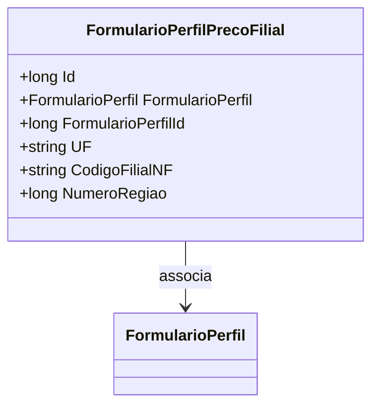

# FormularioPerfilPrecoFilial
**Namespace**: IsthmusWinthor.Dominio.Entidades  
**Nome do Arquivo**: FormularioPerfilPrecoFilial.cs  

## Visão Geral e Responsabilidade
A classe `FormularioPerfilPrecoFilial` atua como uma entidade do domínio que representa a configuração de preços para um formulário de perfil em uma filial específica. Seu papel é garantir que todos os dados relacionados ao perfil de preços de uma filial sejam armazenados e geridos corretamente, permitindo que a aplicação ofereça preços diferenciados com base em regiões e filiais. Isso aborda a necessidade de flexibilidade e adaptação dos preços em distintos locais, considerando as particularidades de cada filial.

## Métodos de Negócio
Não há métodos com lógica de negócios nessa classe. Os métodos implementados são simples getters e setters para as propriedades.

## Propriedades Calculadas e de Validação
Não existem propriedades com lógica de cálculo ou validação no get/set nesta classe.

## Navigation Property
- [FormularioPerfil](FormularioPerfil.md) - Este é um modelo que representa um perfil específico, estando diretamente associado ao `FormularioPerfilPrecoFilial`.

## Tipos Auxiliares e Dependências
Nenhum tipo auxiliar ou enum é utilizado diretamente nesta classe.

## Diagrama de Relacionamentos

