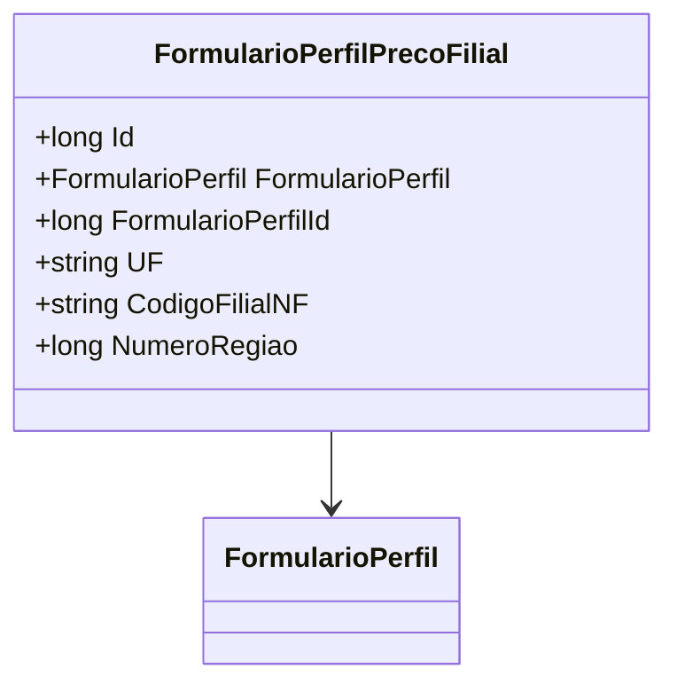

# FormularioPerfilPrecoFilial
**Namespace**: IsthmusWinthor.Dominio.Entidades  
**Nome do Arquivo**: FormularioPerfilPrecoFilial.cs

## Visão Geral e Responsabilidade
A classe `FormularioPerfilPrecoFilial` representa uma entidade do domínio que lida com a configuração de perfis de preço para filiais em um sistema corporativo. Ela é responsável por manter a integridade dos dados relacionados ao perfil de preço de uma filial, associado a uma região específica, permitindo a aplicação de regras de negócio que envolvem a precificação e a localização geográfica das filiais.

## Métodos de Negócio
*Neste código não foram encontrados métodos de negócio com lógica, todos os métodos implementados são acessores simples.*

## Propriedades Calculadas e de Validação
- Não foram encontradas propriedades que possuam lógica no `get` ou validação no `set`.

## Navigation Property
- [`FormularioPerfil`](FormularioPerfil.md): Esta propriedade representa a relação entre o perfil de preço e o formulário específico, permitindo acessar os detalhes de perfil associados a um formulário de preço.

## Tipos Auxiliares e Dependências
- Não foram identificados enumeradores (Enums) ou classes estáticas/helpers que a classe utiliza.

## Diagrama de Relacionamentos

---
Gerada em 29/12/2025 20:34:00
