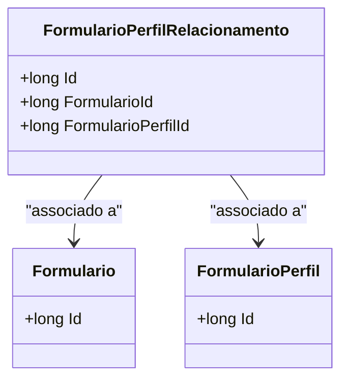

# FormularioPerfilRelacionamento
**Namespace**: IsthmusWinthor.Dominio.Entidades  
**Nome do Arquivo**: FormularioPerfilRelacionamento.cs  

## Visão Geral e Responsabilidade
A classe `FormularioPerfilRelacionamento` atua como um modelo de domínio que representa a relação entre formulários e perfis de formulário no sistema. Sua principal responsabilidade é estabelecer e manter a conexão entre diferentes entidades, permitindo que o sistema gerencie quais perfis estão associados a quais formulários. Essa classe resolve o problema de mapeamento de relacionamentos complexos entre formulários e seus perfis, garantindo que as associações sejam claras e acessíveis dentro do contexto do sistema.

## Métodos de Negócio
*Esta classe não possui métodos de negócio implementados que incorporem lógica condicional complexa. Todos os métodos presentes são simples propriedades e métodos de acesso.*

## Propriedades Calculadas e de Validação
- **Id**: Propriedade de identificação única da entidade. Não possui lógica de validação ou cálculo.
- **Formulario**: Representa a relação com a entidade `Formulario` e permite acessar o formulário associado.
- **FormularioId**: Propriedade que armazena a identificação do formulário. É uma referência direta à entidade padrão, não possui lógica de validação.
- **FormularioPerfil**: Relação com a entidade `FormularioPerfil`, permitindo acesso ao perfil associado ao formulário.
- **FormularioPerfilId**: Armazena a identificação do perfil do formulário, servindo como referência, sem lógica de validação.

## Navigation Properties
- [Formulario](Formulario.md)
- [FormularioPerfil](FormularioPerfil.md)

## Tipos Auxiliares e Dependências
- Não existem tipos auxiliares ou enumeradores utilizados nesta classe.

## Diagrama de Relacionamentos

---
Gerada em 29/12/2025 20:34:10
