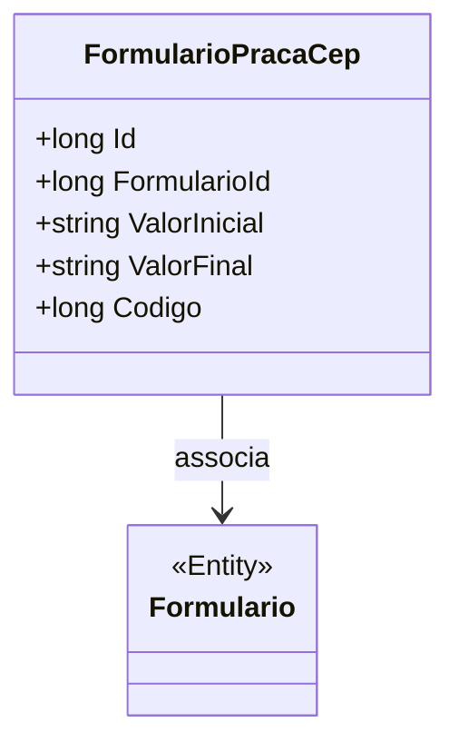

# FormularioPracaCep
**Namespace**: IsthmusWinthor.Dominio.Entidades  
**Nome do Arquivo**: FormularioPracaCep.cs  

## Visão Geral e Responsabilidade
A classe `FormularioPracaCep` representa uma entidade do domínio que gerencia informações relacionadas a um formulário específico de prazos e códigos postais (CEPs). Seu principal objetivo é armazenar limites de valores (inicial e final) e um código associado, garantindo que dados relevantes para a manipulação de formulários estejam devidamente organizados e acessíveis na aplicação.

## Métodos de Negócio
Atualmente, não há métodos com lógica de negócios nesta classe; todos os métodos são, na verdade, getters e setters para as propriedades. 

## Propriedades Calculadas e de Validação
Atualmente, não existem propriedades com lógica de cálculo ou validações na classe `FormularioPracaCep`.

## Navigations Property
- `[Formulario](Formulario.md)`: Representa a classe complexa associada que contém os dados e operações do formulário.

## Tipos Auxiliares e Dependências
- `[TipoEnum](TipoEnum.md)`: Enum utilizado no domínio (conforme importação em `using IsthmusWinthor.Dominio.Enumeradores`).

## Diagrama de Relacionamentos

