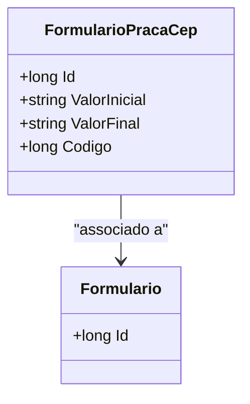

# FormularioPracaCep
- **Namespace**: IsthmusWinthor.Dominio.Entidades
- **Nome do Arquivo**: FormularioPracaCep.cs

## Visão Geral e Responsabilidade
A classe `FormularioPracaCep` representa um conceito específico da aplicação, atuando como uma entidade que faz a ligação entre informações de um formulário e intervalos de código postal (CEP). Essa classe é fundamental para garantir a integridade dos dados relacionados aos valores iniciais e finais de CEP, permitindo que o sistema valide e processe corretamente entradas de dados que dependem desses intervalos.

## Métodos de Negócio
Esta classe, conforme o código analisado, não possui métodos com lógica de negócio evidente além das propriedades.

## Propriedades Calculadas e de Validação
- `ValorInicial`: Propriedade que deve garantir que o valor armazenado seja um CEP válido. Existe uma lógica implícita que deve validar a formatação e o intervalo.
- `ValorFinal`: Semelhantemente, também deve validar se o CEP final está dentro de uma faixa aceitável e que respeita as regras de negócio de intervalos.

## Navigations Property
- [Formulario](Formulario.md): Representa o formulário relacionado ao intervalo de CEPs.

## Tipos Auxiliares e Dependências
- [TipoEnum](TipoEnum.md): Enum que pode ser utilizado nas regras de validação associadas aos códigos postais.

## Diagrama de Relacionamentos

---
Gerada em 29/12/2025 20:34:19
