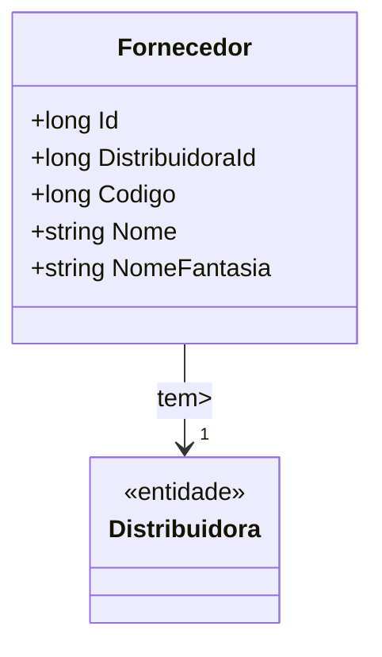

# Fornecedor
**Namespace**: IsthmusWinthor.Dominio.Entidades  
**Nome do Arquivo**: Fornecedor.cs  

## Visão Geral e Responsabilidade
A classe `Fornecedor` atua como uma entidade no domínio que gerencia a representação de um fornecedor dentro do sistema. Ela é responsável por armazenar informações essenciais sobre um fornecedor, como sua identificação, distribuição e nomenclatura. O desafio de negócio que esta classe resolve é a necessidade de gerenciar a relação entre a distribuidora e os fornecedores, garantindo que cada fornecedor esteja associado corretamente a uma distribuidora específica.

## Métodos de Negócio
Não existem métodos com lógica de negócio complexa na classe `Fornecedor`. Todos os métodos são simples e relacionados ao gerenciamento de dados.

## Propriedades Calculadas e de Validação
Não existem propriedades que contenham lógica de cálculo ou validação.

## Navigations Property
- [Distribuidora](Distribuidora.md): A classe `Distribuidora` representa a entidade que o fornecedor está associado.

## Tipos Auxiliares e Dependências
Nenhum enumerador ou classe auxiliar está sendo utilizado nesta classe.

## Diagrama de Relacionamentos

---
Gerada em 29/12/2025 20:34:26
