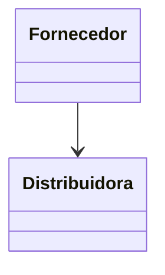

# Fornecedor
**Namespace**: IsthmusWinthor.Dominio.Entidades  
**Nome do Arquivo**: Fornecedor.cs  

## Visão Geral e Responsabilidade
A classe `Fornecedor` representa um fornecedor dentro do sistema, atuando como um registro essencial que armazena informações relevantes a respeito das entidades fornecedoras que interagem com a `Distribuidora`. Tais informações são cruciais para a gestão de relacionamentos comerciais e para garantir a integridade e a rastreabilidade dos recursos fornecidos.

## Métodos de Negócio
A classe `Fornecedor` não possui métodos de negócio complexos que implementem regras.

## Propriedades Calculadas e de Validação
- Não existem propriedades com lógica de cálculo no `get` ou validação no `set`.

## Navigations Property
- [Distribuidora](Distribuidora.md)

## Tipos Auxiliares e Dependências
- Nenhum tipo auxiliar ou dependência identificada nesta classe.

## Diagrama de Relacionamentos

