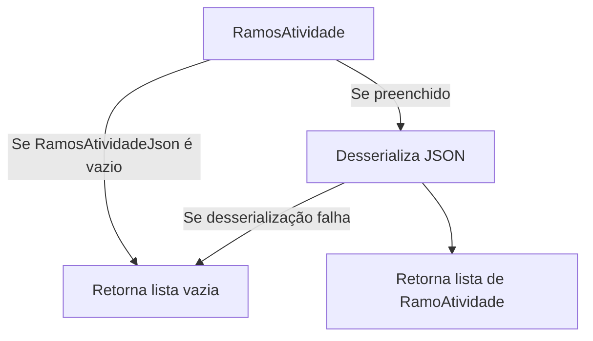
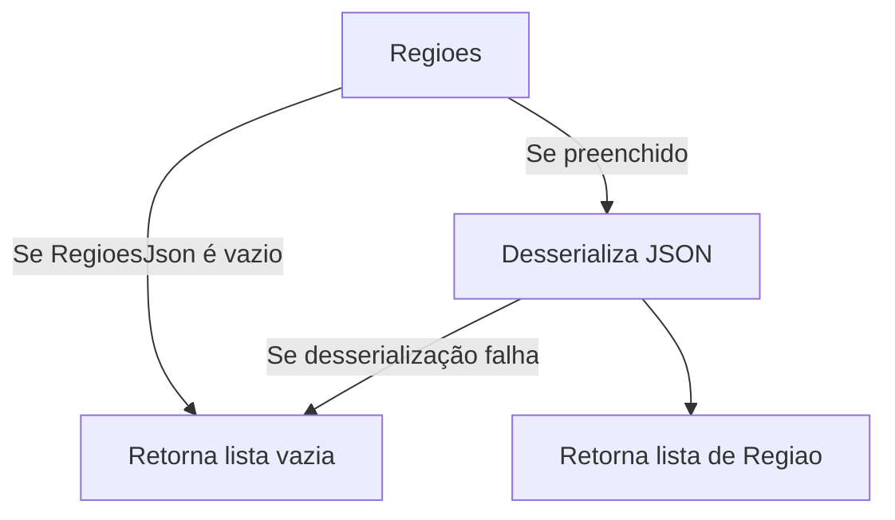
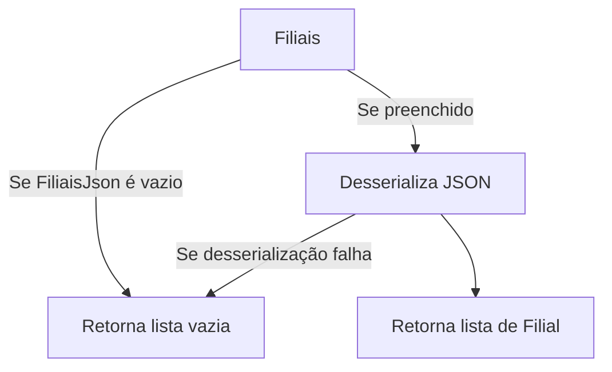
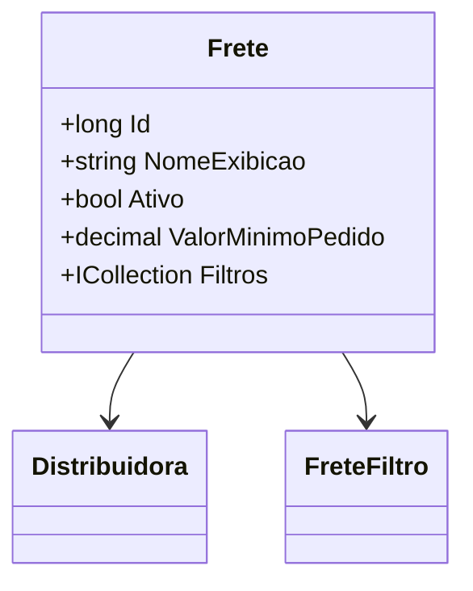

# Frete
- **Namespace**: IsthmusWinthor.Dominio.Entidades
- **Nome do Arquivo**: Frete.cs

## Visão Geral e Responsabilidade
A classe `Frete` representa a configuração de frete dentro do sistema, atuando como a raiz de agregado que orquestra as regras de negócio relacionadas à entrega de produtos. Sua responsabilidade inclui gerenciar as diversas opções de frete, controlar regras de aplicação de frete, e integração com serviços externos, garantindo que as operações relacionadas ao transporte sejam executadas de acordo com as políticas de negócio da distribuidora.

## Métodos de Negócio
### 1. Método: RamosAtividade
- **Visibilidade:** Público
- **Objetivo:** Este método valida e recupera uma lista de ramos de atividade a partir de um JSON armazenado.
- **Comportamento:** 
  1. Verifica se a string `RamosAtividadeJson` é nula ou vazia.
  2. Se for, retorna uma lista vazia.
  3. Caso contrário, tenta desserializar o JSON em uma lista de `RamoAtividade`.
  4. Se a desserialização falhar (exceção capturada), retorna uma lista vazia.
- **Retorno:** Retorna uma lista de `RamoAtividade` que representa os ramos de atividades associados ao frete. 

### 2. Método: Regioes
- **Visibilidade:** Público
- **Objetivo:** Este método valida e recupera uma lista de regiões a partir de um JSON armazenado.
- **Comportamento:**
  1. Verifica se a string `RegioesJson` é nula ou vazia.
  2. Se for, retorna uma lista vazia.
  3. Caso contrário, tenta desserializar o JSON em uma lista de `Regiao`.
  4. Se a desserialização falhar (exceção capturada), retorna uma lista vazia.
- **Retorno:** Retorna uma lista de `Regiao` que representa as regiões abrangidas pela aplicação do frete para o respectivo serviço.

### 3. Método: Filiais
- **Visibilidade:** Público
- **Objetivo:** Este método valida e recupera uma lista de filiais a partir de um JSON armazenado.
- **Comportamento:**
  1. Verifica se a string `FiliaisJson` é nula ou vazia.
  2. Se for, retorna uma lista vazia.
  3. Caso contrário, tenta desserializar o JSON em uma lista de `Filial`.
  4. Se a desserialização falhar (exceção capturada), retorna uma lista vazia.
- **Retorno:** Retorna uma lista de `Filial` que representa as filiais que aceitam retirada no local para o tipo de frete configurado.

## Propriedades Calculadas e de Validação
### Propriedades:
- `RamosAtividade`: Converte um JSON em uma lista de `RamoAtividade` e aplica validações para garantir que não haja falhas durante a desserialização.
- `Regioes`: Converte um JSON em uma lista de `Regiao` e aplica validações para garantir que não haja falhas durante a desserialização.
- `Filiais`: Converte um JSON em uma lista de `Filial` e aplica validações para garantir que não haja falhas durante a desserialização.

## Navigation Property
- `Distribuidora`: `[Distribuidora](Distribuidora.md)`
- `Filtros`: `[FreteFiltro](FreteFiltro.md)`

## Tipos Auxiliares e Dependências
- Enumeradores:
  - `[TipoFrete](TipoFrete.md)`
  - `[TipoFreteCorreios](TipoFreteCorreios.md)`
  - `[FiltroTipoPessoaFreteEnum](FiltroTipoPessoaFreteEnum.md)`
  - `[FiltroCepOrigemFreteEnum](FiltroCepOrigemFreteEnum.md)`
  - `[FiltroAplicacaoFrete](FiltroAplicacaoFrete.md)`

## Diagrama de Relacionamentos

