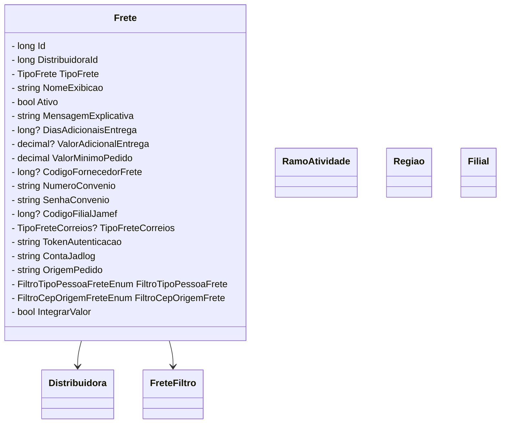

# Frete
**Namespace**: IsthmusWinthor.Dominio.Entidades  
**Nome do Arquivo**: Frete.cs  

## Visão Geral e Responsabilidade
A classe `Frete` representa as regras e características associadas ao sistema de frete dentro do domínio. Ela está responsável por armazenar todas as informações relevantes sobre as taxas e condições de entrega de produtos, permitindo a eficácia na gestão e integração de serviços de frete. Esse modelo de domínio se propõe a solucionar a necessidade de configuração e personalização do frete conforme os critérios exigidos pelo negócio e os diversos tipos de distribuição.

## Métodos de Negócio

### 1. Método: RamosAtividade (Visibilidade: Public)
- **Objetivo**: Este método garante a validação e a recuperação da lista de ramos de atividade a partir de um JSON armazenado na propriedade `RamosAtividadeJson`.
- **Comportamento**: 
  1. Verifica se `RamosAtividadeJson` está vazio ou nulo.
  2. Se estiver vazio, retorna uma nova lista vazia de `RamoAtividade`.
  3. Caso contrário, tenta desserializar o JSON em uma lista de `RamoAtividade`.
  4. Se a desserialização falhar, captura a exceção e retorna uma nova lista vazia.
- **Retorno**: Retorna uma lista de objetos `RamoAtividade`. Se a desserialização falhar, retorna uma lista vazia.

### 2. Método: Regioes (Visibilidade: Public)
- **Objetivo**: Semelhante ao método acima, este método garante a recuperação de regiões a partir de um JSON armazenado na propriedade `RegioesJson`.
- **Comportamento**:
  1. Verifica se `RegioesJson` está vazio ou nulo.
  2. Retorna uma lista vazia se essa condição for verdadeira.
  3. Se não estiver vazio, tenta desserializar o JSON em uma lista de `Regiao`.
  4. Caso ocorra uma falha na desserialização, captura a exceção e retorna uma nova lista vazia.
- **Retorno**: Retorna uma lista de objetos `Regiao`. Se a desserialização falhar, retorna uma lista vazia.

### 3. Método: Filiais (Visibilidade: Public)
- **Objetivo**: Este método coleta os códigos das filiais que aceitam retirada no local, a partir do JSON presente na propriedade `FiliaisJson`.
- **Comportamento**:
  1. Verifica se `FiliaisJson` está vazio ou nulo.
  2. Se estiver vazio, retorna uma lista vazia de `Filial`.
  3. Se não estiver vazio, tenta desserializar o JSON para uma lista de `Filial`.
  4. Caso haja uma falha na desserialização, captura a exceção e retorna uma nova lista vazia.
- **Retorno**: Retorna uma lista de objetos `Filial`. Se a desserialização falhar, retorna uma lista vazia.

## Propriedades Calculadas e de Validação
- **RamosAtividade**: Extrai a lista de ramos de atividade a partir da string JSON `RamosAtividadeJson`. A conversão é feita utilizando a biblioteca Newtonsoft.Json e é validada para garantir que não ocorram falhas.
- **Regioes**: Similar à propriedade `RamosAtividade`, esta propriedade fornece a lista de regiões a partir da string JSON `RegioesJson`, com a mesma lógica de validação.
- **Filiais**: Propriedade que converte o JSON `FiliaisJson` em uma lista de filiais, validando a integridade da string e tratando exceções de forma adequada.

## Navigations Property
- **Distribuidora**: Representa a associação com a classe [Distribuidora](Distribuidora.md).
- **Filtros**: Refere-se à coleção de filtros aplicáveis ao frete, associada à classe [FreteFiltro](FreteFiltro.md).

## Tipos Auxiliares e Dependências
- **Enumeradores**:
  - [TipoFrete](TipoFrete.md)
  - [TipoFreteCorreios](TipoFreteCorreios.md)
  - [FiltroAplicacaoFrete](FiltroAplicacaoFrete.md)
  - [FiltroTipoPessoaFreteEnum](FiltroTipoPessoaFreteEnum.md)
  - [FiltroCepOrigemFreteEnum](FiltroCepOrigemFreteEnum.md)

## Diagrama de Relacionamentos

---
Gerada em 29/12/2025 20:34:53
