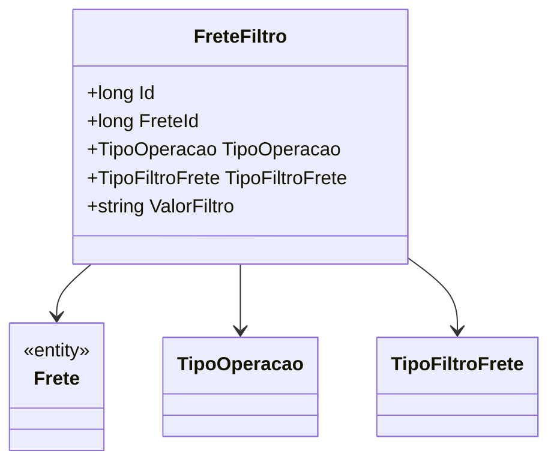

# FreteFiltro
**Namespace**: IsthmusWinthor.Dominio.Entidades  
**Nome do Arquivo**: FreteFiltro.cs  

## Visão Geral e Responsabilidade
A classe `FreteFiltro` é um Rich Domain Model que representa os filtros a serem aplicados em operações de frete. O objetivo principal desta classe é encapsular a lógica necessária para definir os critérios de filtragem de informações de frete, garantindo que as regras de negócio relacionadas a operações e tipos de filtro sejam respeitadas.

## Métodos de Negócio
Nenhum método com lógica de negócio foi implementado nesta classe. Todos os métodos são acessores ou mutadores simples para as propriedades.

## Propriedades Calculadas e de Validação
Nenhuma propriedade com lógica no `get` ou validação no `set` foi identificada nesta classe. As propriedades são anêmicas e apenas armazenam dados.

## Navigation Property
- [Frete](Frete.md)

## Tipos Auxiliares e Dependências
- [TipoOperacao](TipoOperacao.md)
- [TipoFiltroFrete](TipoFiltroFrete.md)

## Diagrama de Relacionamentos

