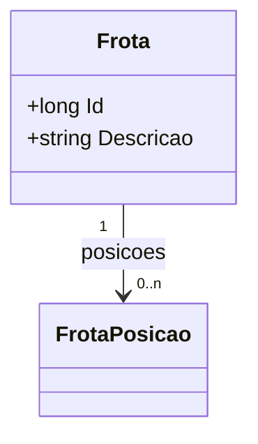

# Frota
**Namespace**: IsthmusWinthor.Dominio.Entidades  
**Nome do Arquivo**: Frota.cs  

## Visão Geral e Responsabilidade
A classe `Frota` representa um conjunto de veículos dentro do domínio de negócio, sendo responsável por agrupar informações e comportamentos relacionados a uma frota específica. Ela resolve o problema de gerenciamento e rastreamento de veículos em uma empresa, permitindo a manipulação de suas posições e características associadas.

## Métodos de Negócio
No código apresentado, a classe `Frota` não contém métodos de negócio com lógica complexa. Portanto, esta seção não se aplica.

## Propriedades Calculadas e de Validação
- Não há propriedades calculadas ou de validação nesta classe.

## Navigation Property
- `Posicoes`: Esta propriedade é uma coleção que representa as posições associadas a uma `Frota`. É uma relação de um para muitos, onde cada frota pode ter várias posições.

### Links de navegação
- `[FrotaPosicao](FrotaPosicao.md)`

## Tipos Auxiliares e Dependências
- A classe `Frota` utiliza a interface `IEntidade`, que deve estar definida em algum lugar no código base.  
- Não há enumeradores ou classes auxiliares estáticas diretamente associados a esta classe.

### Links de navegação
- `[IEntidade](IEntidade.md)`

## Diagrama de Relacionamentos

