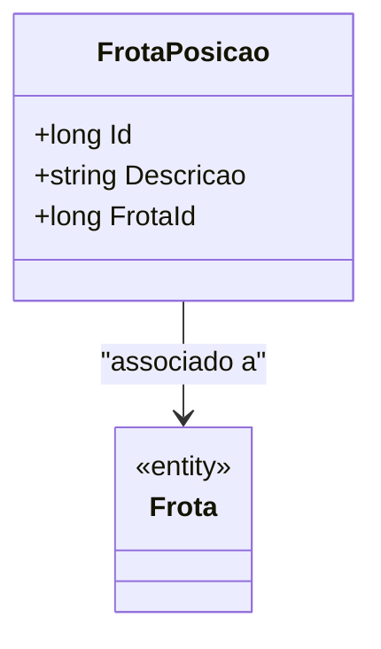

# FrotaPosicao
**Namespace**: IsthmusWinthor.Dominio.Entidades  
**Nome do Arquivo**: FrotaPosicao.cs  

## Visão Geral e Responsabilidade
A classe `FrotaPosicao` representa uma entidade que se relaciona com a posição de uma frota específica em um determinado contexto. Seu papel é manter informações relevantes sobre a frota, permitindo a gestão e acompanhamento das operações ligadas à sua localização e estado ao longo do tempo. A classe ajuda a garantir que as informações sobre a frota estejam organizadas e disponíveis para outras partes do sistema que precisam interagir com os dados da frota.

## Métodos de Negócio
Atualmente, a classe `FrotaPosicao` não possui métodos com lógica de negócios complexa que exijam uma descrição detalhada. Somente os métodos padrão de acesso são utilizados. Assim, a documentação será focada nas propriedades e seus significados.

## Propriedades Calculadas e de Validação
As propriedades da classe são simples e não possuem lógica de validação ou cálculos em seus `get` ou `set`. Cada propriedade armazenará diretamente seus valores correspondentes.

## Navigation Property
- `[Frota](Frota.md)`: Propriedade que representa a frota associada a esta posição. Esta é uma classe complexa que contém mais informações sobre a frota em questão.

## Tipos Auxiliares e Dependências
- Nenhum tipo auxiliar, enumerador ou helper é utilizado diretamente nesta classe.

## Diagrama de Relacionamentos

Esta documentação apresenta as informações essenciais sobre a classe `FrotaPosicao`, permitindo que desenvolvedores e stakeholders compreendam sua estrutura, associações e responsabilidades no contexto do sistema corporativo.
